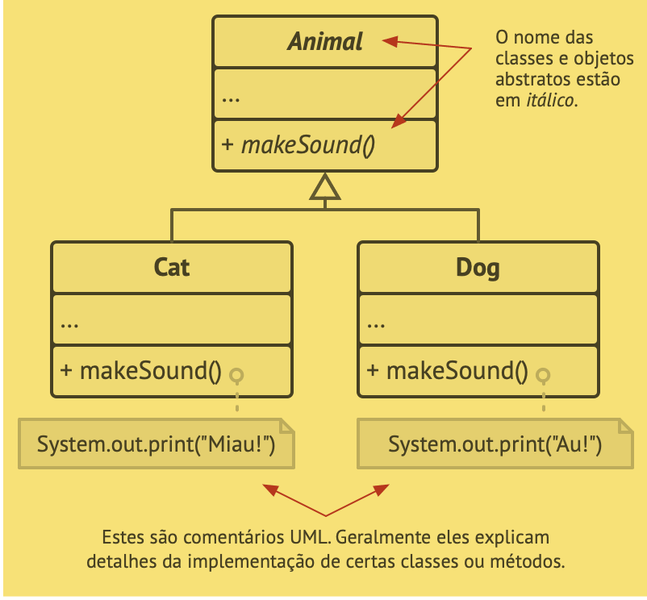

# Pilares da POO

- Abs­tra­ção
    - Na mai­o­ria das vezes quando você está cri­ando um pro­grama com a POO, você molda os ob­je­tos do pro­grama ba­se­ado em ob­je­tos do mundo real.
    - A Abs­tra­ção é um mo­delo de um ob­jeto ou fenô­meno do mundo real, li­mi­tado a um con­texto es­pe­cí­fico, que re­pre­senta todos os de­ta­lhes re­le­van­tes para este con­texto com grande pre­ci­são e omite o resto.

- Encapsulamento
    - Para ligar um motor de carro, você pre­cisa ape­nas girar a chave ou aper­tar um botão. Você não pre­cisa co­nec­tar os fios de­baixo do capô, ro­ta­ci­o­nar o eixo das ma­ni­ve­las e ci­lin­dros, e ini­ciar o ciclo de força do motor. Estes de­ta­lhes estão em­baixo do capô do carro. Você tem ape­nas uma in­ter­face sim­ples: um in­ter­rup­tor de ig­ni­ção, um vo­lante, e al­guns pe­dais. Isso ilus­tra como cada ob­jeto tem um in­ter­face—uma parte pú­blica do ob­jeto, aberto a in­te­ra­ções com ou­tros objetos.
    - O En­cap­su­la­mento é a ha­bi­li­dade de um ob­jeto de es­con­der parte de seu es­tado e com­por­ta­men­tos de ou­tros ob­je­tos, ex­pondo ape­nas uma in­ter­face li­mi­tada para o resto do programa.

- Herança
    - A He­rança é a ha­bi­li­dade de cons­truir novas clas­ses em cima de clas­ses já exis­ten­tes. O maior be­ne­fí­cio da he­rança é a reu­ti­li­za­ção de có­digo.

- Polimorfismo
    - Vamos ver al­guns exem­plos de ani­mais. A mai­o­ria dos Animais podem pro­du­zir sons. Nós po­de­mos an­te­ci­par que todas as sub­clas­ses terão que so­bres­cre­ver o mé­todo base produzir Som para que cada sub­classe possa emi­tir o som cor­reto; por­tanto nós po­de­mos de­clará-lo abs­trato agora mesmo. Isso per­mite omi­tir qual­quer im­ple­men­ta­ção pa­drão do mé­todo na su­per­classe, mas força todas as sub­clas­ses a se vi­ra­rem com o que têm.
    - O Po­li­mor­fismo é a ha­bi­li­dade de um pro­grama de­tec­tar a classe real de um ob­jeto e cha­mar sua im­ple­men­ta­ção mesmo quando seu tipo real é des­co­nhe­cido no con­texto atual.”
    - 
