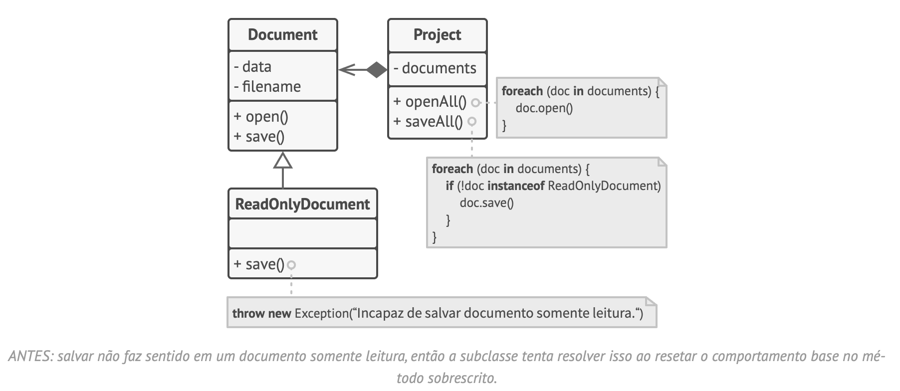

# Princípios SOLID

- Prin­cí­pio de res­pon­sa­bi­li­dade única (Single Res­pon­si­bi­lity Prin­ci­ple)
    - Uma classe deve ter ape­nas uma razão para mudar.
    - Tente fazer com que cada classe seja res­pon­sá­vel por uma única parte da fun­ci­o­na­li­dade for­ne­cida pelo soft­ware, e faça aquela res­pon­sa­bi­li­dade ser in­tei­ra­mente en­cap­su­lada pela (po­de­mos tam­bém dizer es­con­dida den­tro da) classe.
    - O ob­je­tivo prin­ci­pal deste prin­cí­pio é re­du­zir a com­ple­xi­dade. ”
    - Exemplo:
        - 
        - 

- “Prin­cí­pio aberto/fe­chado (Open/Clo­sed Prin­ci­ple)
    - As clas­ses devem ser aber­tas para ex­ten­são mas fe­cha­das para modificação.
    - A ideia prin­ci­pal deste prin­cí­pio é pre­ve­nir que o có­digo exis­tente que­bre quando você im­ple­menta novas fun­ci­o­na­li­da­des.”
    - Exemplo:
        - 
        - 
        - Agora quando você precisar implementar um novo método de envio, você pode derivar uma nova classe da interface 'Shipping' sem tocar em qualquer código da classe 'Order'

- “Prin­cí­pio de subs­ti­tui­ção de Lis­kov (Liskov Subs­ti­tu­tion Prin­ci­ple)
    - Quando es­ten­dendo uma classe, lem­bre-se que você deve ser capaz de pas­sar ob­je­tos da sub­classe em lugar de ob­je­tos da classe mãe sem que­brar o có­digo cliente.
    - Isso sig­ni­fica que a sub­classe deve per­ma­ne­cer com­pa­tí­vel com o com­por­ta­mento da su­per­classe. Quando so­bres­cre­vendo um mé­todo, es­tenda o com­por­ta­mento base ao invés de subs­ti­tuí-lo com algo com­ple­ta­mente diferente.”
    - Detalhes:
        - Os tipos de parâmetros em um método de uma subclasse devem coincidir ou serem mais abstratos que os tipos de parâmetros nos métodos da superclasse.
        - O tipo de retorno de um método de uma subclasse deve coincidir ou ser um subtipo do tipo de retorno no método da superclasse. Como pode ver, os requerimentos para o tipo de retorno são inversos aos requerimentos para tipos de parâmetros.
        - Um método de uma subclasse não deve lançar tipos de exceções que não são esperados que o método base lançaria.
        - Uma subclasse não deve fortalecer pré-condições.
        - Uma subclasse não deveria enfraquecer pós-condições.
        - Invariantes de uma superclasse devem ser preservadas. As invariantes são condições nas quais um objeto faz sentido.
        - Uma subclasse não deve mudar valores de campos privados da superclasse.
    - Exemplo:
        - 
        - 

- “Prin­cí­pio de se­gre­ga­ção de in­ter­face (Inter­face Se­gre­ga­tion Prin­ci­ple)
    - Cli­en­tes não devem ser for­ça­dos a de­pen­der de mé­to­dos que não usam.”
    - Exemplo:
        - 
        - 

- “Prin­cí­pio de in­ver­são de de­pen­dên­cia (Depen­dency In­ver­sion Prin­ci­ple)
    - Clas­ses de alto nível não de­ve­riam de­pen­der de clas­ses de baixo nível. Ambas devem de­pen­der de abs­tra­ções. As abs­tra­ções não devem de­pen­der de de­ta­lhes. De­ta­lhes devem de­pen­der de abstrações.”
    - Exemplo:
        - 
        - 

Trechos de
Mergulho nos Padrões de Projeto
Alexander Shvets
Este material pode estar protegido por copyright.