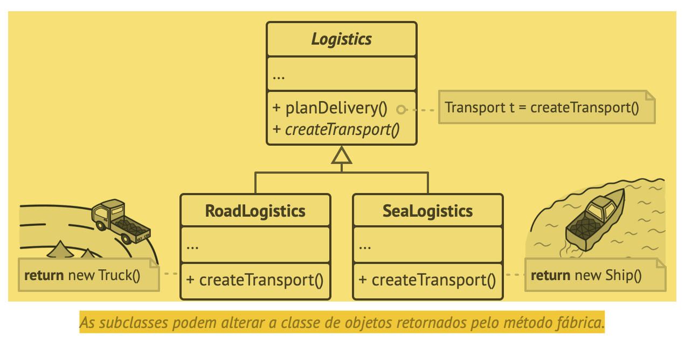
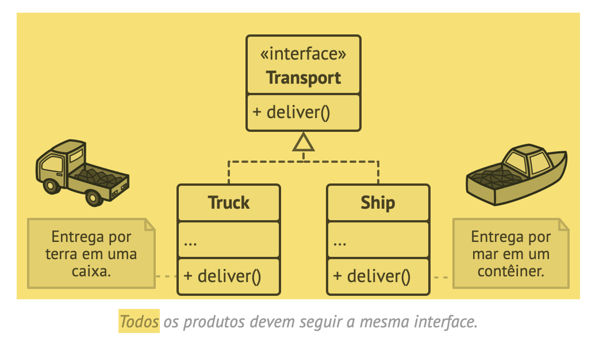
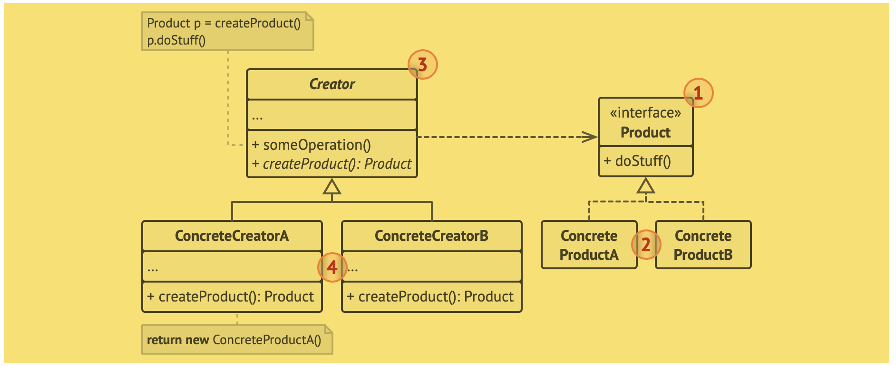
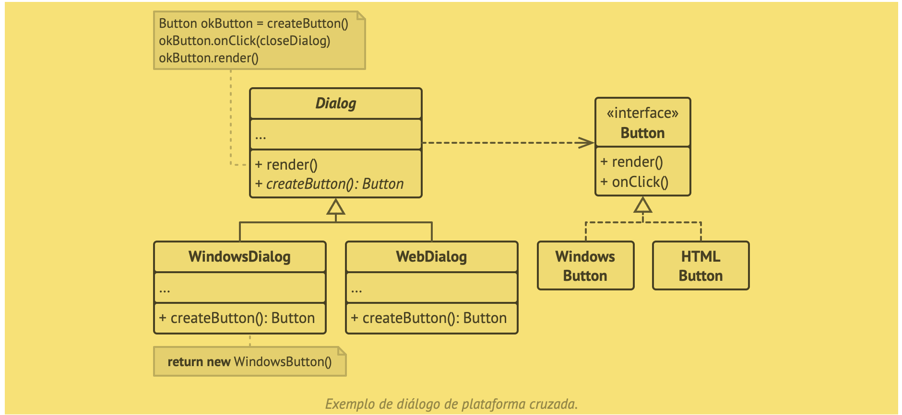

# FACTORY METHOD

Também conhecido como: Método fábrica, Construtor virtual

O Factory Method é um padrão criacional de projeto que fornece uma interface para criar objetos em uma superclasse, mas permite que as subclasses alterem o tipo de objetos que serão criados.

- Solução
    - O padrão Factory Method sugere que você substitua chamadas diretas de construção de objetos (usando o operador new) por chamadas para um método fábrica especial. Não se preocupe: os objetos ainda são criados através do operador new, mas esse está sendo chamado de dentro do método fábrica. Objetos retornados por um método fábrica geralmente são chamados de produtos.
    - 
    - À primeira vista, essa mudança pode parecer sem sentido: apenas mudamos a chamada do construtor de uma parte do programa para outra. No entanto, considere o seguinte: agora você pode sobrescrever o método fábrica em uma subclasse e alterar a classe de produtos que estão sendo criados pelo método.
    - Porém, há uma pequena limitação: as subclasses só podem retornar tipos diferentes de produtos se esses produtos tiverem uma classe ou interface base em comum. Além disso, o método fábrica na classe base deve ter seu tipo de retorno declarado como essa interface.
    - 

- Estrutura
    - 

- Pseudocódigo
    - “Este exemplo ilustra como o Factory Method pode ser usado para criar elementos de interface do usuário multiplataforma sem acoplar o código do cliente às classes de UI concretas.”
    - 
    - 
    ```pascal
    // A classe criadora declara o método fábrica que deve retornar
    // um objeto de uma classe produto. As subclasses da criadora
    // geralmente fornecem a implementação desse método.
    class Dialog is
    // A criadora também pode fornecer alguma implementação
    // padrão do Factory Method.
    abstract method createButton():Button
    
    // Observe que, apesar do seu nome, a principal
    // responsabilidade da criadora não é criar produtos. Ela
    // geralmente contém alguma lógica de negócio central que
    // depende dos objetos produto retornados pelo método
    // fábrica. As subclasses pode mudar indiretamente essa
    // lógica de negócio ao sobrescreverem o método fábrica e
    // retornarem um tipo diferente de produto dele.
    method render() is
        // Chame o método fábrica para criar um objeto produto.
        Button okButton = createButton()
        // Agora use o produto.
        okButton.onClick(closeDialog)
        okButton.render()
        
    // Criadores concretos sobrescrevem o método fábrica para mudar
    // o tipo de produto resultante.
    class WindowsDialog extends Dialog is
      method createButton():Button is
        return new WindowsButton()
    
    class WebDialog extends Dialog is
      method createButton():Button is
        return new HTMLButton()

    // A interface do produto declara as operações que todos os
    // produtos concretos devem implementar.
    interface Button is
      method render()
      method onClick(f)

    // Produtos concretos fornecem várias implementações da
    // interface do produto.
    class WindowsButton implements Button is
      method render(a, b) is
        // Renderiza um botão no estilo Windows.
      method onClick(f) is
        // Vincula um evento de clique do SO nativo.

    class HTMLButton implements Button is
      method render(a, b) is
        // Retorna uma representação HTML de um botão.
      method onClick(f) is
        // Vincula um evento de clique no navegador web.

    class Application is
      field dialog: Dialog

      // A aplicação seleciona um tipo de criador dependendo da
      // configuração atual ou definições de ambiente.
      method initialize() is
        config = readApplicationConfigFile()

        if (config.OS == "Windows") then
          dialog = new WindowsDialog()
        else if (config.OS == "Web") then
          dialog = new WebDialog()
        else
          throw new Exception("Error! Unknown operating system.")

      // O código cliente trabalha com uma instância de um criador
      // concreto, ainda que com sua interface base. Desde que o
      // cliente continue trabalhando com a criadora através da
      // interface base, você pode passar qualquer subclasse da
      // criadora.
      method main() is
        this.initialize()
        dialog.render()

    ```


Trecho de
Mergulho nos Padrões de Projeto
Alexander Shvets
Este material pode estar protegido por copyright.