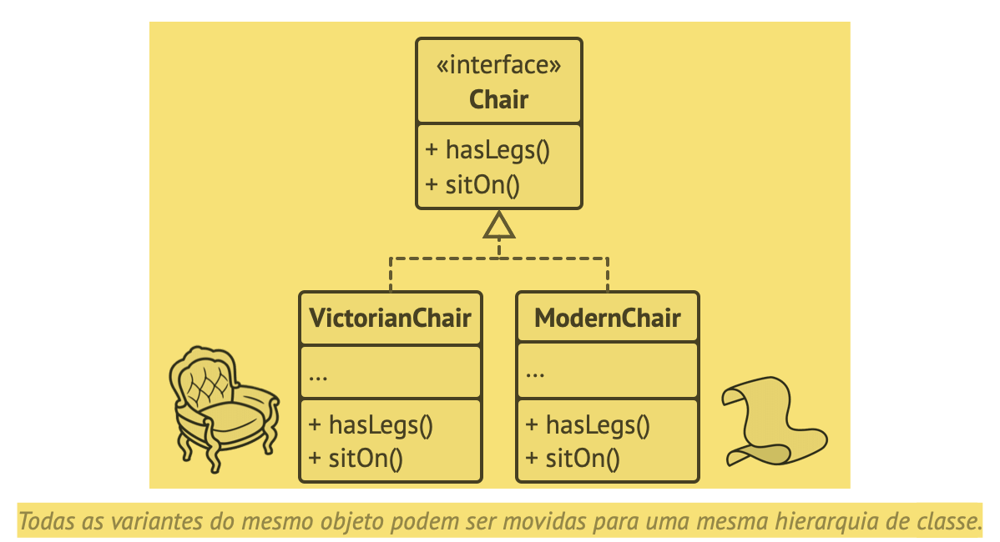
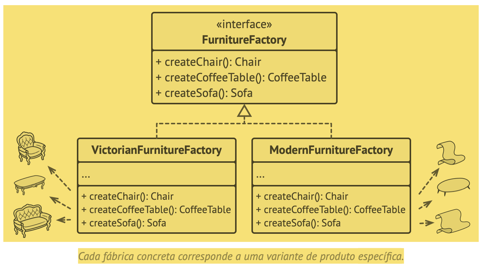
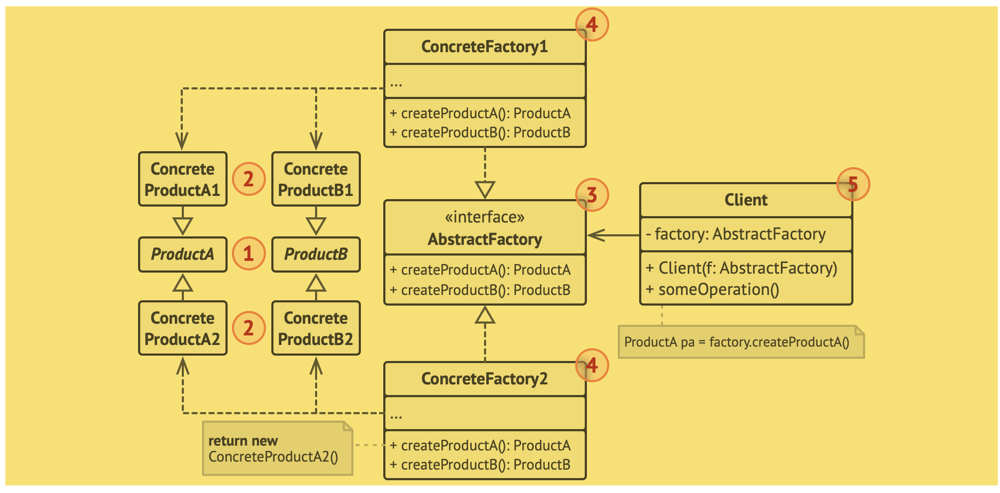
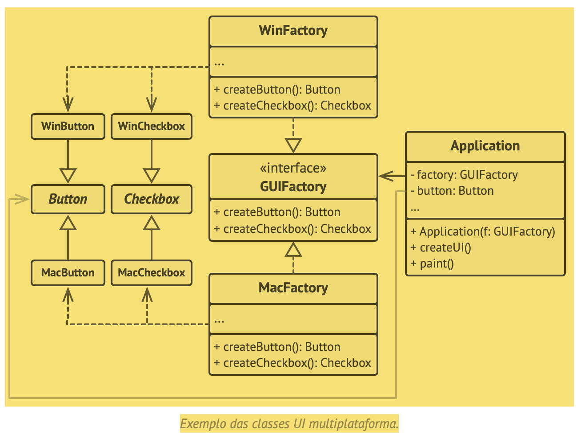

 # ABSTRACT FACTORY (Fábrica abstrata)

 * padrão de projeto criacional que permite que você produza famílias de objetos relacionados sem ter que especificar suas classes concretas.

 - 
 - 

 - "Geralmente, o programa cria um objeto fábrica concreto no estágio de inicialização. Antes disso, o programa deve selecionar o tipo de fábrica dependendo da configuração ou definições de ambiente."

 - Estrutura
    - 
    - 1. “Produtos Abstratos declaram interfaces para um conjunto de produtos distintos mas relacionados que fazem parte de uma família de produtos.
    - 2. Produtos Concretos são várias implementações de produtos abstratos, agrupados por variantes. Cada produto abstrato (cadeira/sofá) deve ser implementado em todas as variantes dadas (Vitoriano/Moderno).
    - 3. A interface Fábrica Abstrata declara um conjunto de métodos para criação de cada um dos produtos abstratos.
    - 4. Fábricas Concretas implementam métodos de criação fábrica abstratos. Cada fábrica concreta corresponde a uma variante específica de produtos e cria apenas aquelas variantes de produto.
    - 5. Embora fábricas concretas instanciam produtos concretos, assinaturas dos seus métodos de criação devem retornar produtos abstratos correspondentes. Dessa forma o código cliente que usa uma fábrica não fica ligada a variante específica do produto que ele pegou de uma fábrica. O Cliente pode trabalhar com qualquer variante de produto/fábrica concreto, desde que ele se comunique com seus objetos via interfaces abstratas.”

- Pseudocódigo
    - 
    - Com essa abordagem, o código cliente não depende de classes concretas de fábricas e elementos UI desde que ele trabalhe com esses objetos através de suas interfaces abstratas. Isso também permite que o código do cliente suporte outras fábricas ou elementos UI que você possa adicionar no futuro.
    - Como resultado, você não precisa modificar o código do cliente cada vez que adicionar uma variação de elementos de UI em sua aplicação. Você só precisa criar uma nova classe fábrica que produza esses elementos e modificar de forma sutil o código de inicialização da aplicação de forma que ele selecione aquela classe quando apropriado.

Trechos de
Mergulho nos Padrões de Projeto
Alexander Shvets
Este material pode estar protegido por copyright.