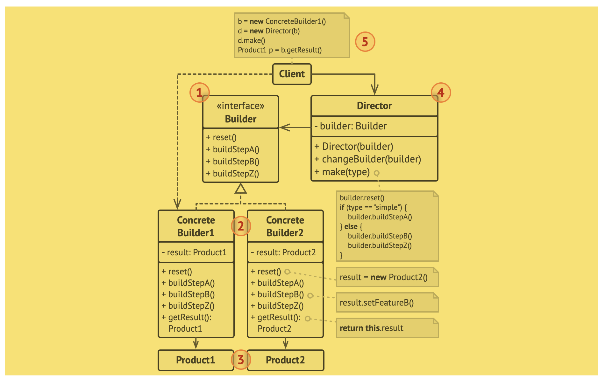
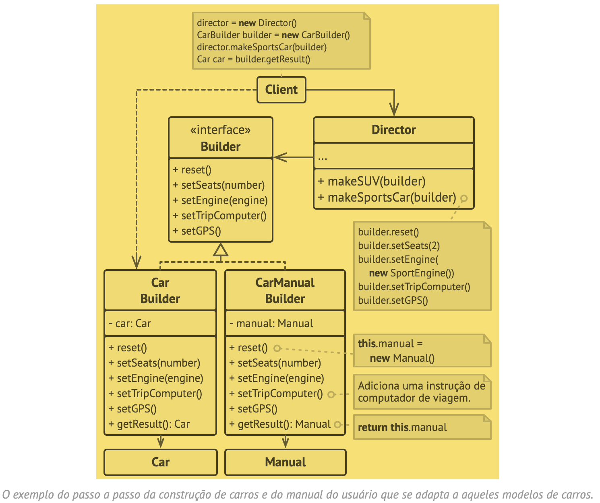

# BUILDER (Construtor)

- O Builder é um padrão de projeto criacional que permite a você construir objetos complexos passo a passo. O padrão permite que você produza diferentes tipos e representações de um objeto usando o mesmo código de construção.

- Problema
  - Imagine um objeto complexo que necessite de uma inicialização passo a passo trabalhosa de muitos campos e objetos agrupados. Tal código de inicialização fica geralmente enterrado dentro de um construtor monstruoso com vários parâmetros. Ou pior: espalhado por todo o código cliente.
  - A solução mais simples é estender a classe base Casa e criar um conjunto de subclasses para cobrir todas as combinações de parâmetros. Mas eventualmente você acabará com um número considerável de subclasses.
  - Há outra abordagem que não envolve a propagação de subclasses. Você pode criar um construtor gigante diretamente na classe Casa base com todos os possíveis parâmetros que controlam o objeto casa. 
    - Na maioria dos casos a maioria dos parâmetros não será usada, tornando as chamadas do construtor em algo feio de se ver.

- Solução 
  - O padrão Builder sugere que você extraia o código de construção do objeto para fora de sua própria classe e mova ele para objetos separados chamados builders. “Builder” significa “construtor”, mas não usaremos essa palavra para evitar confusão com os construtores de classe.
  - Diretor 
    - Você pode ir além e extrair uma série de chamadas para as etapas do builder que você usa para construir um produto em uma classe separada chamada diretor

- Estrutura
  - 

- Pseudocódigo
  - Este exemplo do padrão Builder ilustra como você pode reutilizar o mesmo código de construção de objeto quando construindo diferentes tipos de produtos, tais como carros, e como criar manuais correspondentes para eles.
  - 

- Aplicabilidade
  - Use o padrão Builder para se livrar de um "construtor telescópico".

- Relações com outros padrões
  - O Builder foca em construir objetos complexos passo a passo. O Abstract Factory se especializa em criar famílias de objetos relacionados. O Abstract Factory retorna o produto imediatamente, enquanto que o Builder permite que você execute algumas etapas de construção antes de buscar o produto.

Trecho de
Mergulho nos Padrões de Projeto
Alexander Shvets
Este material pode estar protegido por copyright.

Trecho de
Mergulho nos Padrões de Projeto
Alexander Shvets
Este material pode estar protegido por copyright.

Trecho de
Mergulho nos Padrões de Projeto
Alexander Shvets
Este material pode estar protegido por copyright.