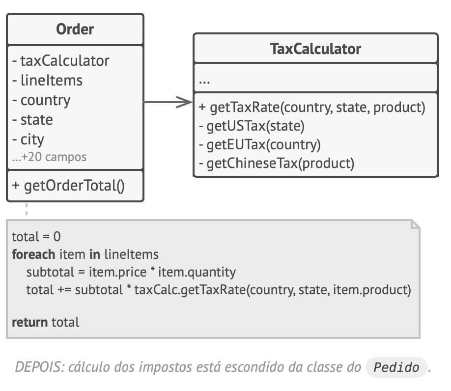
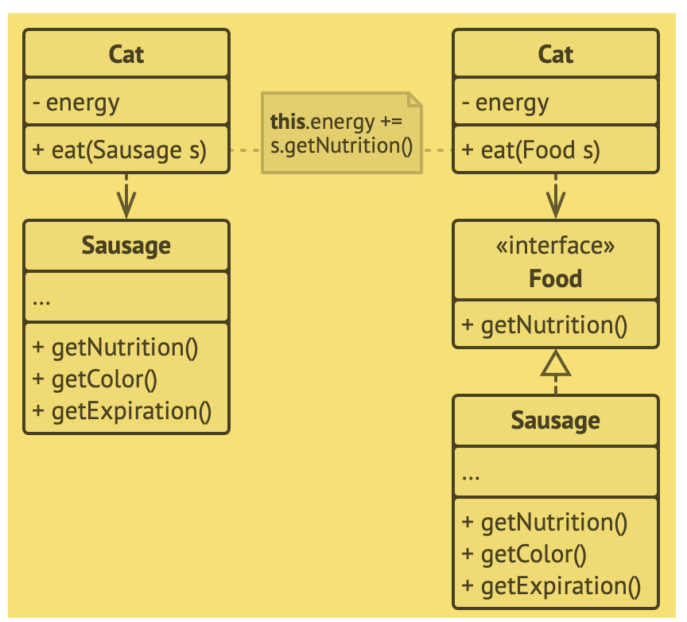

- Características de um bom projeto
    - Reutilização de código
        - “Há tam­bém um nível médio. É aqui que eu vejo os pa­drões. Os pa­drões de pro­jeto são me­no­res e mais abs­tra­tos que os fra­meworks. Eles são uma ver­da­deira des­cri­ção de como um par de clas­ses pode se re­la­ci­o­nar e in­te­ra­gir entre si. O nível de reu­ti­li­za­ção au­menta quando você move de clas­ses para pa­drões e, fi­nal­mente, para frameworks.”
    - Extensibilidade
        - Mudança é a única constante na vida de um programador.

- Princípios de projeto
    - Encapsule o que varia
        - “Iden­ti­fi­que os as­pec­tos da sua apli­ca­ção que va­riam e se­pare-os dos que per­ma­ne­cem os mesmos.”
        - “O ob­je­tivo prin­ci­pal deste prin­cí­pio é mi­ni­mi­zar o efeito cau­sado por mudanças.”
        - “você pode iso­lar as par­tes de um pro­grama que va­riam em mó­du­los in­de­pen­den­tes, pro­te­gendo o resto do có­digo de efei­tos ad­ver­sos. Dessa forma você gasta menos tempo fa­zendo o pro­grama vol­tar a fun­ci­o­nar, im­ple­men­tando e tes­tando as mu­dan­ças.”
        - “En­cap­su­la­mento à nivel de mé­todo”
            - “Em algum lugar do seu có­digo há um mé­todo obterTotalPedido que cal­cula o total final de um pe­dido, in­cluindo im­pos­tos. Nós po­de­mos an­te­ci­par que o có­digo re­la­ci­o­nado aos im­pos­tos pre­cisa mudar no fu­turo. ”
        - “En­cap­su­la­mento a nível de classe”
            - “Com o tempo você pode que­rer adi­ci­o­nar mais e mais res­pon­sa­bi­li­da­des para um mé­todo que é usado para fazer uma coisa sim­ples. Esses com­por­ta­men­tos adi­ci­o­nais quase sem­pre vem com seus pró­prios cam­pos de ajuda e mé­to­dos que even­tu­al­mente des­fo­cam a res­pon­sa­bi­li­dade pri­má­ria da classe que o con­tém.”
            - “Ob­je­tos da classe Pedido de­le­gam todo o tra­ba­lho re­la­ci­o­nado a im­pos­tos para um ob­jeto es­pe­cial que fará isso.”
            - 

- Programe para uma interface, não uma implementação
    - “Pro­grame para uma in­ter­face, não uma im­ple­men­ta­ção. De­penda de abs­tra­ções, não clas­ses concretas.”
    - “Você pode per­ce­ber se o pro­jeto é fle­xí­vel o bas­tante se você pode es­tendê-lo fa­cil­mente sem que­brar o có­digo exis­tente. Vamos ga­ran­tir que esta afir­ma­ção é cor­reta ao olhar para mais um exem­plo com gatos. Um Gato que pode comer qual­quer co­mida é mais fle­xí­vel que um gato que come ape­nas sal­si­chas. Você ainda pode ali­men­tar o pri­meiro gato com sal­si­chas por­que elas são um sub­con­junto de “qual­quer co­mida”; con­tudo, você pode es­ten­der o car­dá­pio do gato com qual­quer outra comida.”
    - “Quando você quer fazer duas clas­ses co­la­bo­ra­rem, você pode co­me­çar fa­zendo uma delas ser de­pen­dente da outra”
    - Passos:
        1. “De­ter­mi­nar o que exa­ta­mente um ob­jeto pre­cisa do outro: quais mé­to­dos ele exe­cuta?
        2. Des­creva estes mé­to­dos em uma nova in­ter­face ou classe abstrata.
        3. Faça a classe que é uma de­pen­dên­cia im­ple­men­tar essa interface.
        4. Agora faça a se­gunda classe ser de­pen­dente dessa in­ter­face ao invés de fazer isso na classe con­creta. Você ainda pode fazê-la fun­ci­o­nar com ob­je­tos da classe ori­gi­nal, mas a co­ne­xão é agora muito mais flexível.”
        - 