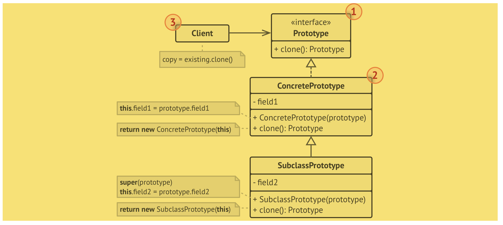
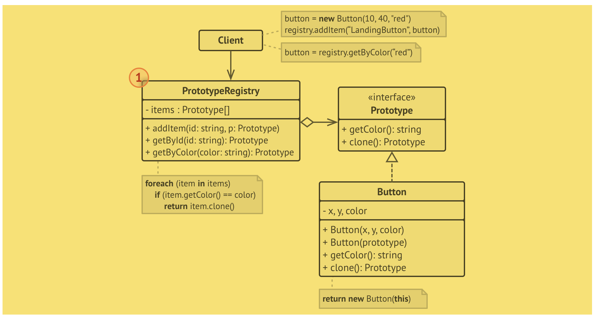

# Prototype (protótipo, clone)
- é um padrão criacional que permite copiar objetos existentes sem fazer seu código ficar dependente de suas classes.

## Problema
- Digamos que você tenha um objeto, e você quer criar uma cópia exata dele. 
- Nem todos os objetos podem ser copiados facilmente, pois alguns campos podem ser privados e não estão visíveis fora do próprio objeto.

## Solução
- Este padrão delega o processo de clonagem para o próprio objeto que está sendo clonado. O padrão declara um interface comum para todos os objetos que suportam clonagem. Essa interface permite que você clone um objeto sem acoplar seu código à classe daquele objeto. Geralmente, tal interface contém apenas um único método clonar.
- Um objeto que suporta clonagem é chamado de protótipo.

## Estrutura
### Implementação básica
- 
### Implementação do registro do protótipo
- 
- O Registro do Protótipo fornece uma maneira fácil de acessar protótipos de uso frequente. Ele salva um conjunto de objetos pré construídos que estão prontos para serem copiados. O registro de protótipo mais simples é um hashmap nome → protótipo. Contudo, se você precisa de um melhor critério de busca que apenas um nome simples, você pode construir uma versão muito mais robusta do registro.

Trecho de
Mergulho nos Padrões de Projeto
Alexander Shvets
Este material pode estar protegido por copyright.