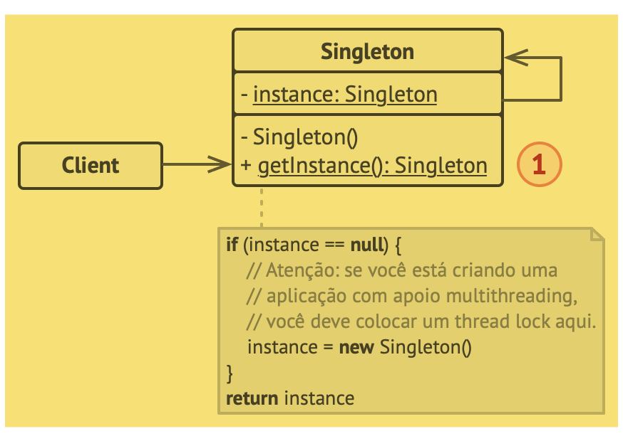

# Singleton (Carta única)
- “O Singleton é um padrão de projeto criacional que permite a você garantir que uma classe tenha apenas uma instância, enquanto provê um ponto de acesso global para essa instância.”

## Estrutura

## Aplicabilidade
- “Utilize o padrão Singleton quando uma classe em seu programa deve ter apenas uma instância disponível para todos seus clientes; por exemplo, um objeto de base de dados único compartilhado por diferentes partes do programa.”
- “Utilize o padrão Singleton quando você precisa de um controle mais estrito sobre as variáveis globais.”

## Prós e contras
- (contra) “Pode ser difícil realizar testes unitários do código cliente do Singleton porque muitos frameworks de teste dependem de herança quando produzem objetos simulados. Já que o construtor da classe singleton é privado e sobrescrever métodos estáticos é impossível na maioria das linguagem, você terá que pensar em uma maneira criativa de simular o singleton. Ou apenas não escreva os testes. Ou não use o padrão Singleton.”

Trecho de
Mergulho nos Padrões de Projeto
Alexander Shvets
Este material pode estar protegido por copyright.