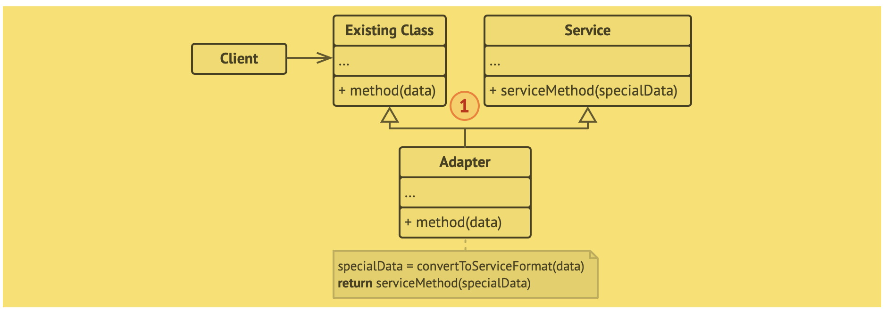

# Adapter (adaptador, wrapper)
“O Adapter é um padrão de projeto estrutural que permite objetos com interfaces incompatíveis colaborarem entre si.”

- “Ele é um objeto especial que converte a interface de um objeto para que outro objeto possa entendê-lo.”

“Adaptadores podem não só converter dados em vários formatos, mas também podem ajudar objetos com diferentes interfaces a colaborar. Veja aqui como funciona:
- O adaptador obtém uma interface, compatível com um dos objetos existentes.
- Usando essa interface, o objeto existente pode chamar os métodos do adaptador com segurança.
- Ao receber a chamada, o adaptador passa o pedido para o segundo objeto, mas em um formato e ordem que o segundo objeto espera.”

## Analogia com o mundo real
“O problema pode ser resolvido usando um adaptador de tomada que tenha o estilo de tomada Brasileira e o plugue no estilo Europeu.”

## Estrutura
### Adaptador de objeto

### Adaptador de classe
“Essa implementação utiliza herança: o adaptador herda interfaces de ambos os objetos ao mesmo tempo. Observe que essa abordagem só pode ser implementada em linguagens de programação que suportam herança múltipla, tais como C++.”

##Pseudocódigo
Esse exemplo do padrão Adapter é baseado no conflito clássico entre pinos quadrados e buracos redondos.

## Como implementar
1. Certifique-se que você tem ao menos duas classes com interfaces incompatíveis:
   - Uma classe serviço útil, que você não pode modificar (quase sempre de terceiros, antiga, ou com muitas dependências existentes).
   - Uma ou mais classes cliente que seriam beneficiadas com o uso da classe serviço.
2. Declare a interface cliente e descreva como o cliente se comunica com o serviço.
3. Cria a classe adaptadora e faça-a seguir a interface cliente. Deixe todos os métodos vazios por enquanto.
4. Adicione um campo para a classe do adaptador armazenar uma referência ao objeto do serviço. A prática comum é inicializar esse campo via o construtor, mas algumas vezes é mais conveniente passá-lo para o adaptador ao chamar seus métodos. 
5. Um por um, implemente todos os métodos da interface cliente na classe adaptadora. O adaptador deve delegar a maioria do trabalho real para o objeto serviço, lidando apenas com a conversão da interface ou formato dos dados. 
6. Os Clientes devem usar o adaptador através da interface cliente. Isso irá permitir que você mude ou estenda o adaptador sem afetar o código cliente.

Trecho de
Mergulho nos Padrões de Projeto
Alexander Shvets
Este material pode estar protegido por copyright.