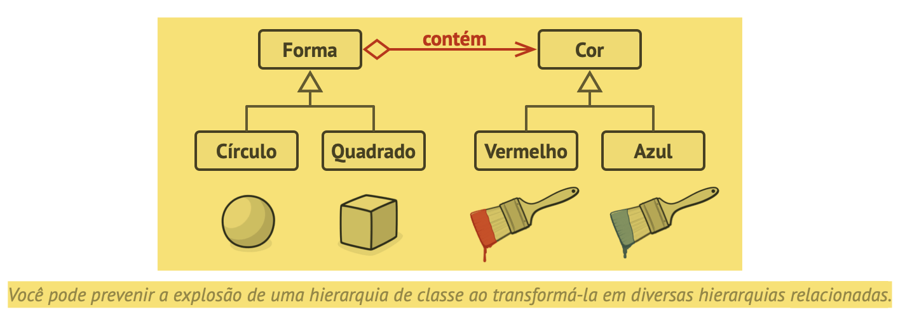
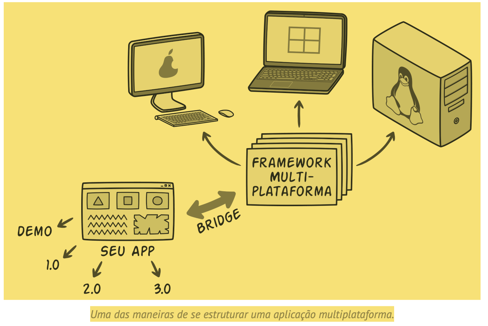
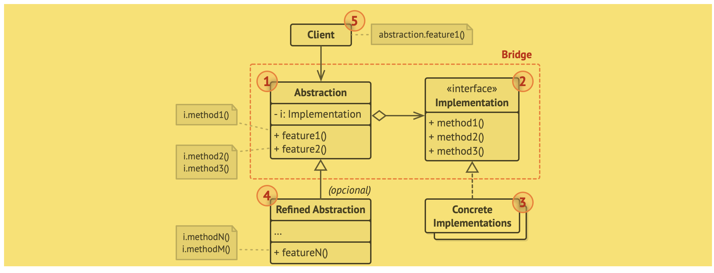
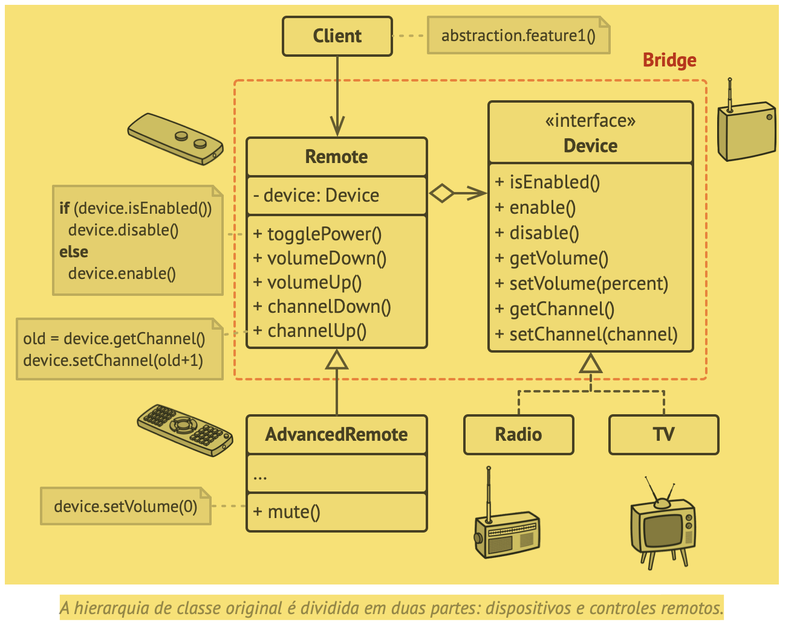

# BRIDGE (Ponte)
“O Bridge é um padrão de projeto estrutural que permite que você divida uma classe grande ou um conjunto de classes intimamente ligadas em duas hierarquias separadas—abstração e implementação—que podem ser desenvolvidas independentemente umas das outras.
”

## Problema
“Digamos que você tem uma classe Forma geométrica com um par de subclasses: Círculo e Quadrado. Você quer estender essa hierarquia de classe para incorporar cores, então você planeja criar as subclasses de forma Vermelho e Azul.”

## Solução
“Esse problema ocorre porque estamos tentando estender as classes de forma em duas dimensões diferentes: por forma e por cor. Isso é um problema muito comum com herança de classe.

O padrão Bridge tenta resolver esse problema ao trocar de herança para composição do objeto. Isso significa que você extrai uma das dimensões em uma hierarquia de classe separada, para que as classes originais referenciem um objeto da nova hierarquia, ao invés de ter todos os seus estados e comportamentos dentro de uma classe.”

“Seguindo essa abordagem nós podemos extrair o código relacionado à cor em sua própria classe com duas subclasses: Vermelho e Azul. A classe Forma então ganha um campo de referência apontando para um dos objetos de cor. Agora a forma pode delegar qualquer trabalho referente a cor para o objeto ligado a cor. Aquela referência vai agir como uma ponte entre as classes Forma e Cor. De agora em diante, para adicionar novas cores não será necessário mudar a hierarquia da forma e vice versa.”

### Abstração e implementação
“Abstração (também chamado de interface) é uma camada de controle de alto nível para alguma entidade. Essa camada não deve fazer nenhum tipo de trabalho por conta própria. Ela deve delegar o trabalho para a camada de implementação (também chamada de plataforma).

Observe que não estamos falando sobre interfaces ou classes abstratas da sua linguagem de programação. São coisas diferentes.”

“Este padrão sugere que as classes sejam divididas em duas hierarquias:

- Abstração: a camada GUI da aplicação.
- Implementação: As APIs do sistema operacional.”

“O objeto da abstração controla a aparência da aplicação, delegando o verdadeiro trabalho para o objeto de implementação ligado. Implementações diferentes são intercambiáveis desde que sigam uma interface comum, permitindo que a mesma GUI trabalhe no Windows e Linux.

Como resultado você pode mudar as classes GUI sem tocar nas classes ligadas a API. Além disso, adicionar suporte para outro sistema operacional só requer a criação de uma subclasse na hierarquia de implementação.”

## Estrutura

## Pseudocódigo

## Aplicabilidade

“Utilize o padrão Bridge quando você quer dividir e organizar uma classe monolítica que tem diversas variantes da mesma funcionalidade (por exemplo, se a classe pode trabalhar com diversos servidores de base de dados).”

Trecho de
Mergulho nos Padrões de Projeto
Alexander Shvets
Este material pode estar protegido por copyright.