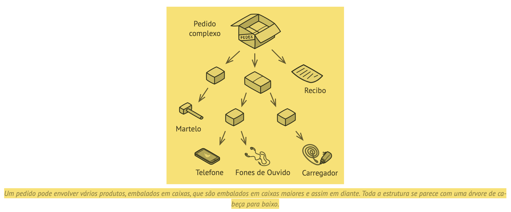
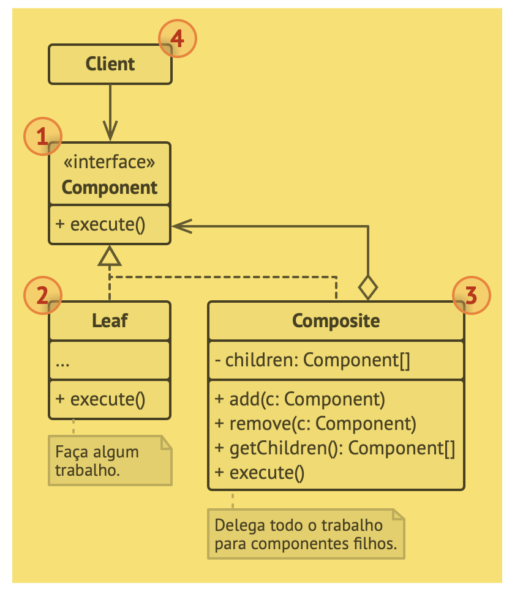
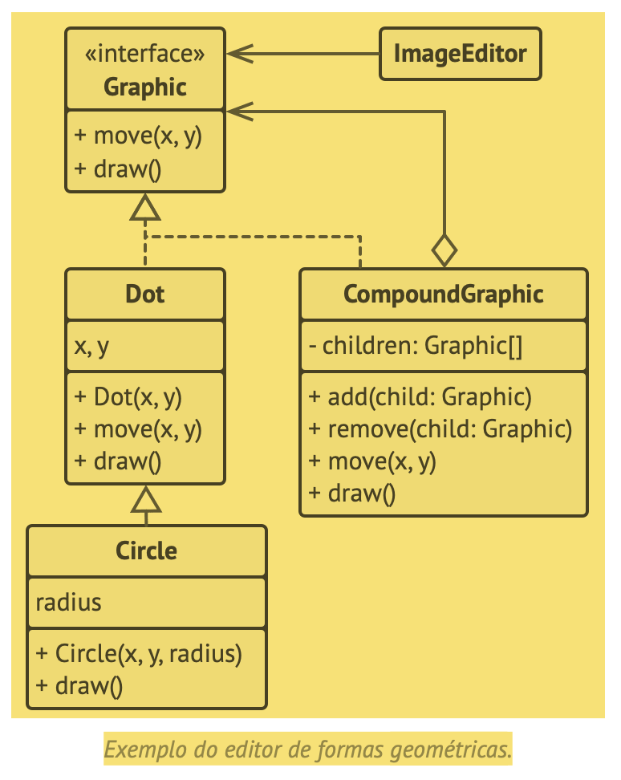

# Composite 
####(árvore de objetos, object tree)

“O Composite é um padrão de projeto estrutural que permite que você componha objetos em estruturas de árvores e então trabalhe com essas estruturas como se elas fossem objetos individuais.

## Problema
Usar o padrão Composite faz sentido apenas quando o modelo central de sua aplicação pode ser representada como uma árvore.

## Solução
O padrão Composite sugere que você trabalhe com Produtos e Caixas através de uma interface comum que declara um método para a contagem do preço total.

Como esse método funcionaria? Para um produto, ele simplesmente retornaria o preço dele. Para uma caixa, ele teria que ver cada item que ela contém, perguntar seu preço e então retornar o total para essa caixa

## Estrutura

## Pseudocódigo
Nesse exemplo, o padrão Composite deixa que você implemente pilhas de formas geométricas em um editor gráfico.

## Aplicabilidade
- Utilize o padrão Composite quando você tem que implementar uma estrutura de objetos tipo árvore.
- Utilize o padrão quando você quer que o código cliente trate tanto os objetos simples como os compostos de forma uniforme.

Trecho de
Mergulho nos Padrões de Projeto
Alexander Shvets
Este material pode estar protegido por copyright.