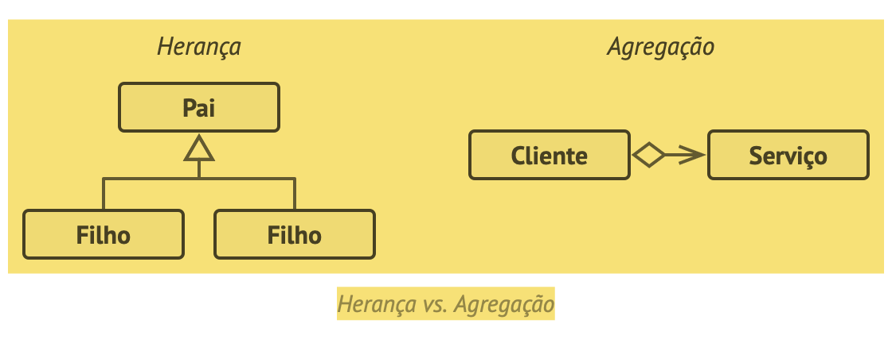
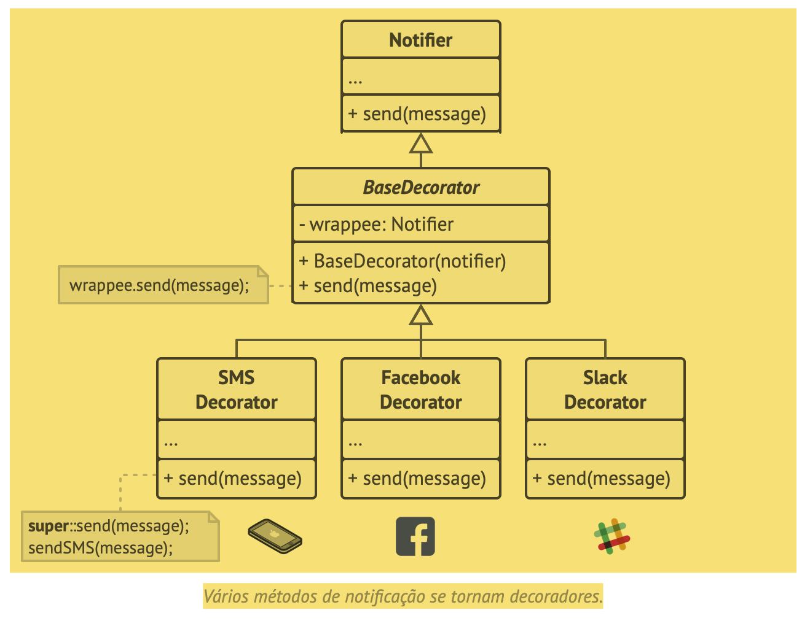
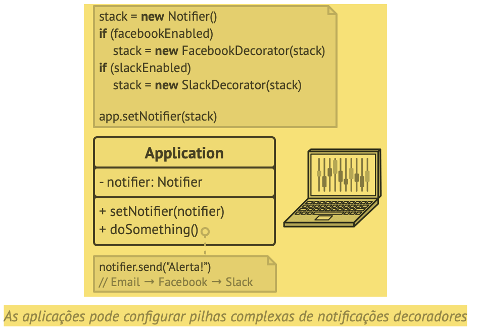
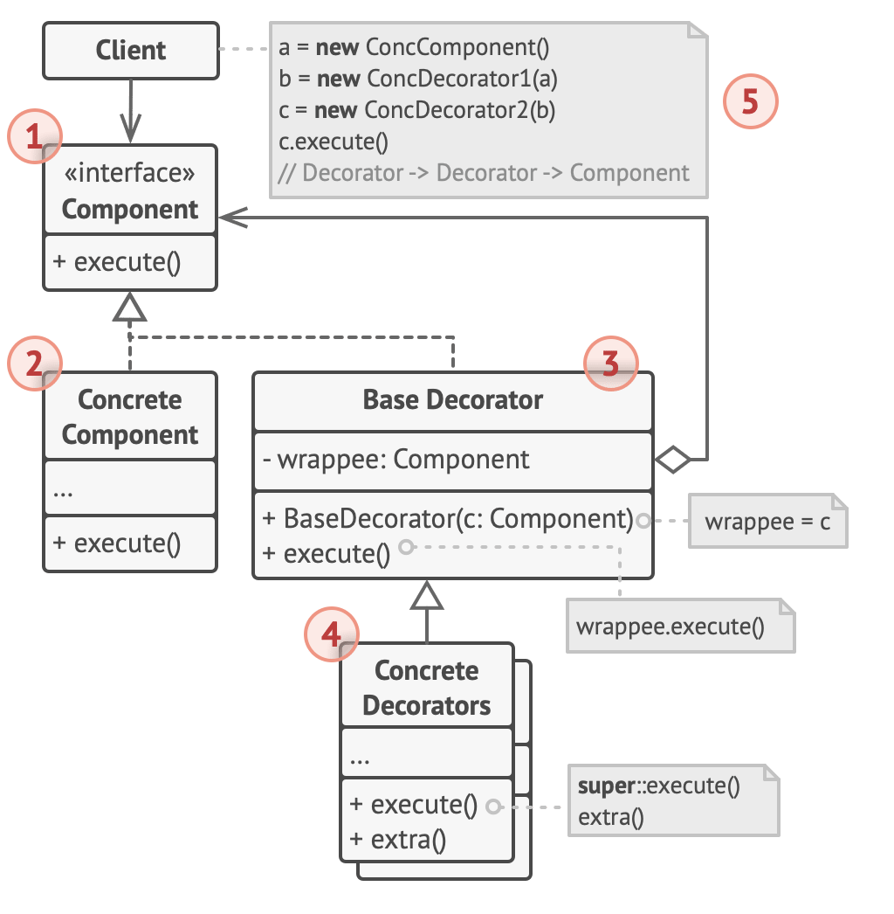
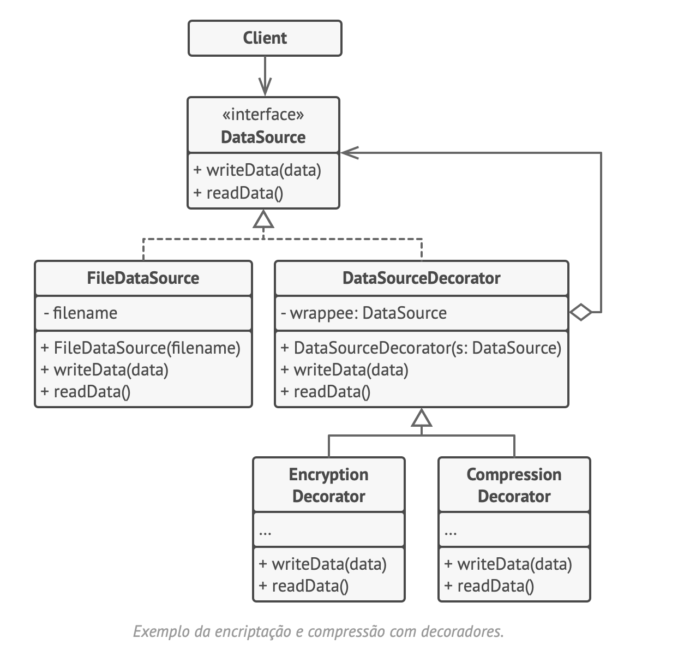

# Decorator
Decorador, Envoltório, Wrapper

É um padrão de projeto estrutural que permite que você acople novos comportamentos para objetos ao colocá-los dentro de invólucros de objetos que contém os comportamentos.

## Solução

Estender uma classe é a primeira coisa que vem à mente quando você precisa alterar o comportamento de um objeto. Contudo, a herança vem com algumas ressalvas sérias que você precisa estar ciente.

A herança é estática. Você não pode alterar o comportamento de um objeto existente durante o tempo de execução. Você só pode substituir todo o objeto por outro que foi criado de uma subclasse diferente.
As subclasses só podem ter uma classe pai. Na maioria das linguagens, a herança não permite que uma classe herde comportamentos de múltiplas classes ao mesmo tempo.”

Envoltório” (ing. “wrapper”) é o apelido alternativo para o padrão Decorator que expressa claramente a ideia principal dele. Um envoltório é um objeto que pode ser ligado com outro objeto alvo. O envoltório contém o mesmo conjunto de métodos que o alvo e delega a ele todos os pedidos que recebe. Contudo, o envoltório pode alterar o resultado fazendo alguma coisa ou antes ou depois de passar o pedido para o alvo.

Quando um simples envoltório se torna um verdadeiro decorador? Como mencionei, o envoltório implementa a mesma interface que o objeto envolvido. É por isso que da perspectiva do cliente esses objetos são idênticos. Faça o campo de referência do envoltório aceitar qualquer objeto que segue aquela interface. Isso lhe permitirá cobrir um objeto em múltiplos envoltórios, adicionando o comportamento combinado de todos os envoltórios a ele.

O código cliente vai precisar envolver um objeto notificador básico em um conjunto de decoradores que coincidem com as preferências do cliente. Os objetos resultantes serão estruturados como uma pilha.

## Analogia com o mundo real
Vestir roupas é um exemplo de usar decoradores, pois você tem um efeito combinado de usar múltiplas peças de roupas.

## Estrutura

## Pseudocódigo

Trecho de
Mergulho nos Padrões de Projeto
Alexander Shvets
Este material pode estar protegido por copyright.