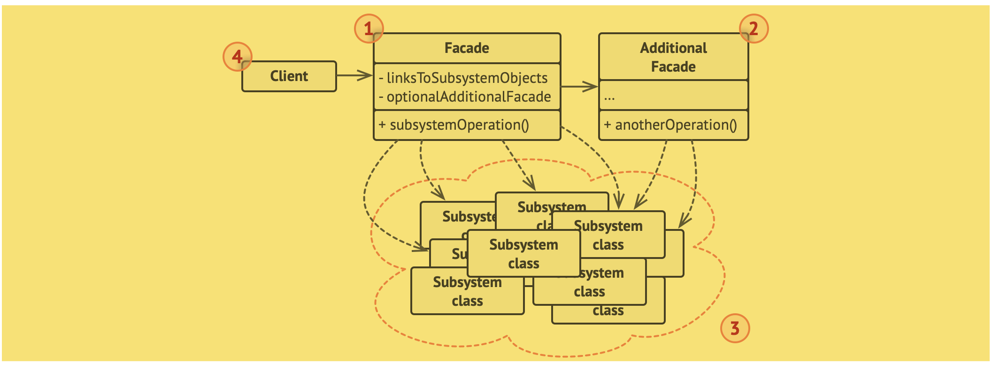
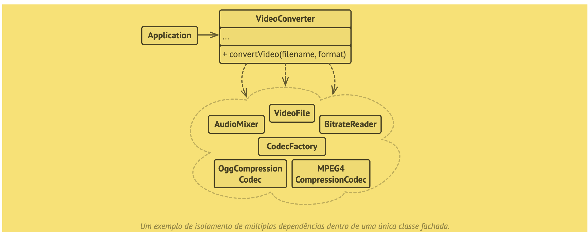

# Facade (fachada)
“O Facade é um padrão de projeto estrutural que fornece uma interface simplificada para uma biblioteca, um framework, ou qualquer conjunto complexo de classes.”

“Uma fachada é uma classe que fornece uma interface simples para um subsistema complexo que contém muitas partes que se movem. Uma fachada pode fornecer funcionalidades limitadas em comparação com trabalhar com os subsistemas diretamente. Contudo, ela inclui apenas aquelas funcionalidades que o cliente se importa.”

## Analogia com o mundo real
- Fazer pedidos por telefone
  - “Quando você liga para uma loja para fazer um pedido, um operador é sua fachada para todos os serviços e departamentos da loja. O operador fornece a você uma simples interface de voz para o sistema de pedido, pagamentos, e vários sistemas de entrega.”

## Estrutura

## Pseudocódigo
“Neste exemplo, o padrão Facade simplifica a interação com um framework complexo de conversão de vídeo.”

## Aplicabilidade
- “Utilize o padrão Facade quando você precisa ter uma interface limitada mas simples para um subsistema complexo.”

Trecho de
Mergulho nos Padrões de Projeto
Alexander Shvets
Este material pode estar protegido por copyright.