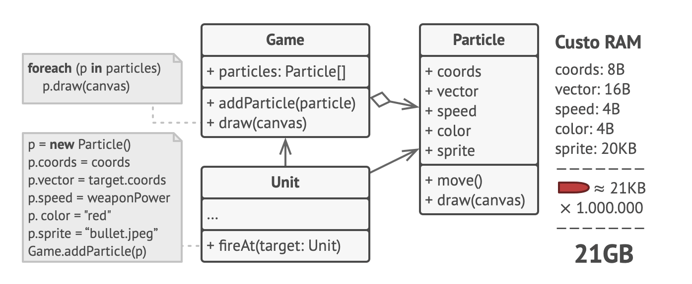
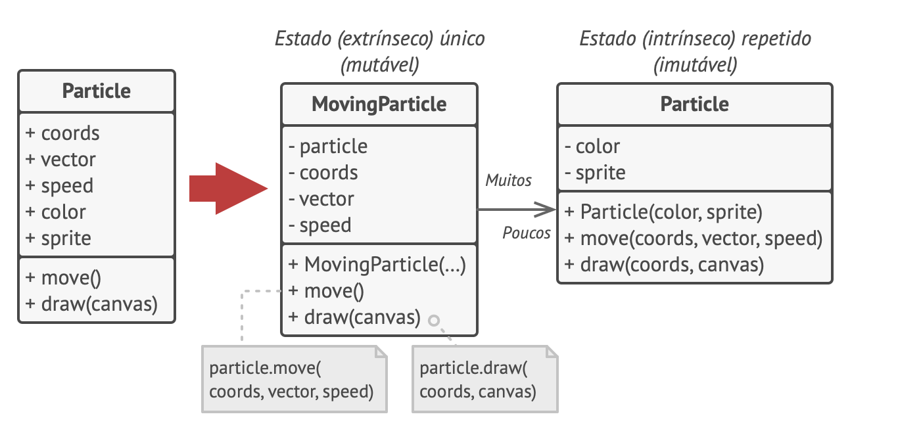

# Flyweight (Peso mosca, cache)
Padrão de projeto estrutural que permite colocar mais objetos na quantidade de RAM disponível ao compartilhar partes comuns de estado entre os múltiplos objetos, ao invés de manter todos os dados em cada objeto.

## Problema
Jogo. Partículas. O verdadeiro problema está relacionado ao seu sistema de partículas. Cada partícula, tais como uma bala, um míssil, ou um estilhaço era representado por um objeto separado contendo muita informação. Em algum momento, quando a destruição na tela do jogadora era tanta, as novas partículas criadas não cabiam mais no RAM restante, então o programa quebrava.

## Solução

Separar estado mutável do imutável.

## Aplicabilidade

Quando o programa deve suportar um grande número de objetos que mal cabem na RAM disponível.

Trecho de
Mergulho nos Padrões de Projeto
Alexander Shvets
Este material pode estar protegido por copyright.