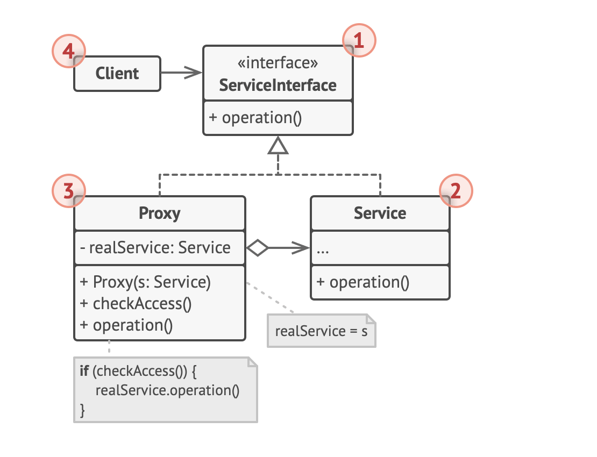
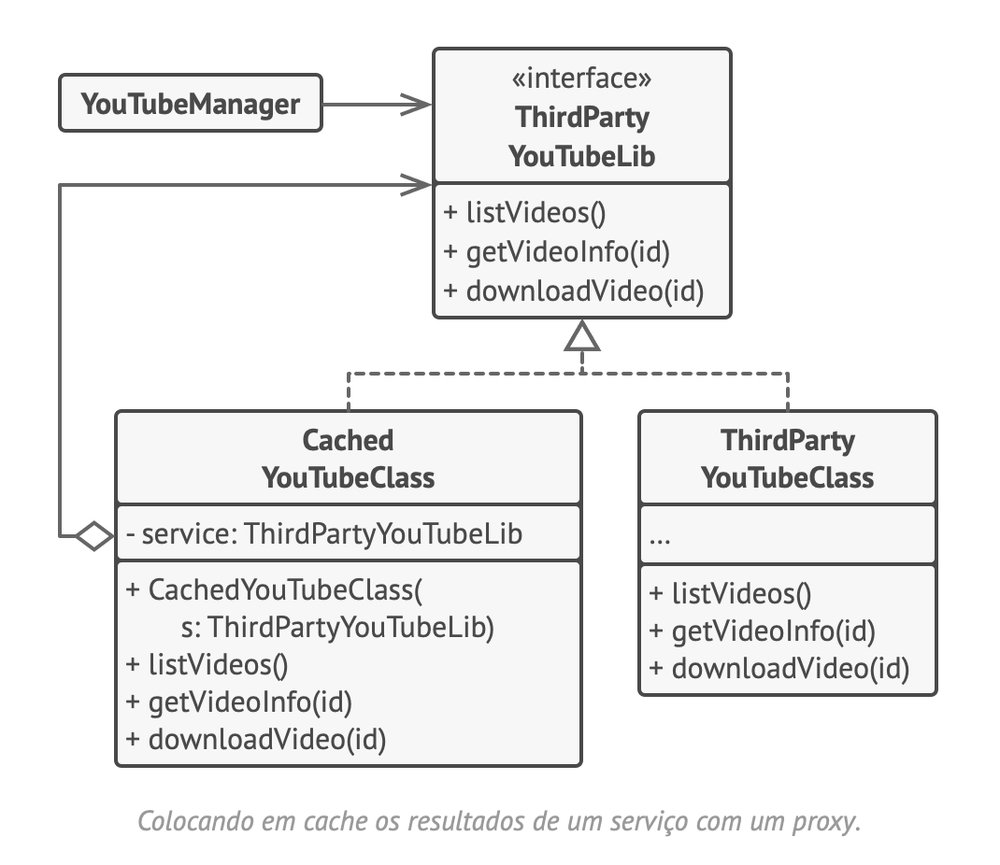

# Proxy
Padrão de projeto estrutural que permite que você forneça um substituto ou um espaço reservado para outro objeto. Um proxy controla o acesso ao objeto original, permitindo que você faça algo ou antes ou depois do pedido chegar ao objeto original.

## Estrutura

## Pseudocódigo

### Relações com outros padrões
- O Decorator e o Proxy têm estruturas semelhantes, mas propósitos muito diferentes. Alguns padrões são construídos no princípio de composição, onde um objeto deve delegar parte do trabalho para outro. A diferença é que o Proxy geralmente gerencia o ciclo de vida de seu objeto serviço por conta própria, enquanto que a composição do Decorator é sempre controlada pelo cliente.