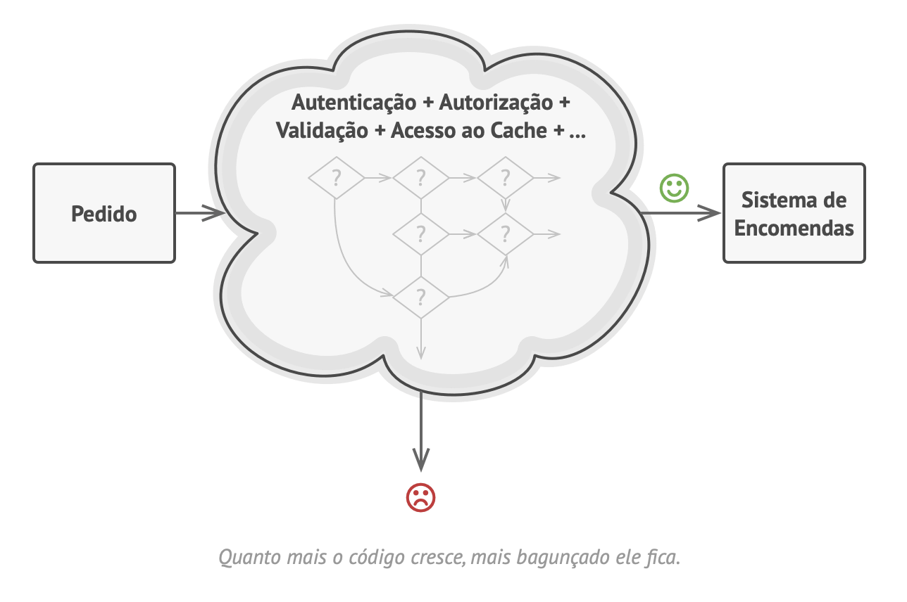
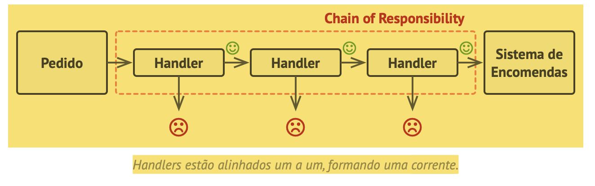
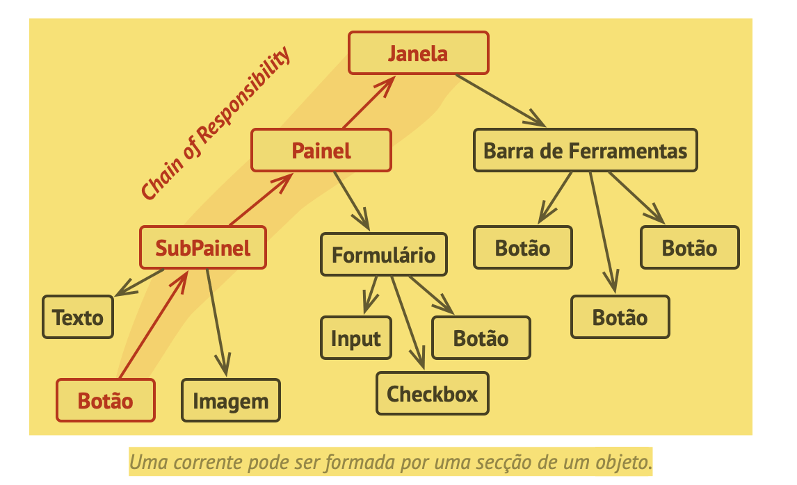
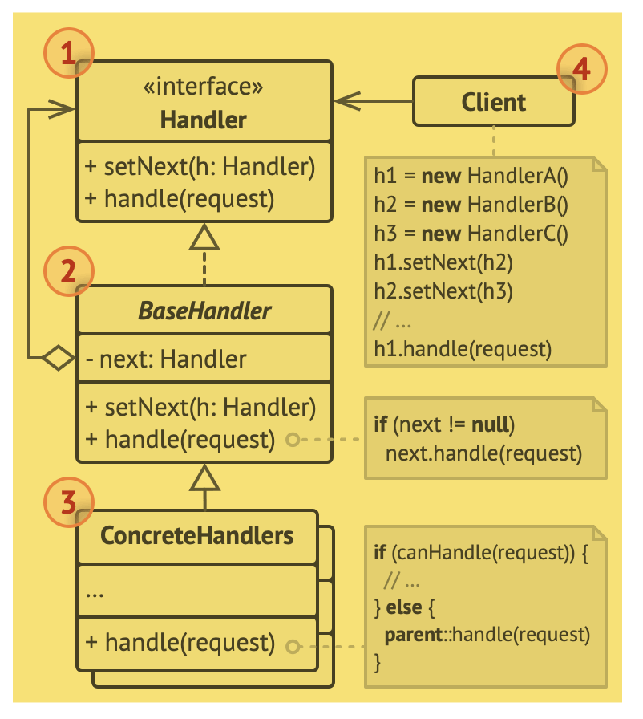

# Chain of responsability
CoR, Corrente de responsabilidade, Corrente de comando, Chain of command

O Chain of Responsibility é um padrão de projeto comportamental que permite que você passe pedidos por uma corrente de handlers. Ao receber um pedido, cada handler decide se processa o pedido ou o passa adiante para o próximo handler nacorrente.

## Problema
Exemplo de problema.

## Solução
O CoR se baseia em transformar certos comportamentos em objetos solitários chamados handlers.

É crucial que todas as classes handler implementem a mesma interface. Cada handler concreto deve se importar apenas se o seguinte tem o método "executar". Dessa maneira você pode compor correntes durante a execução, usando vários handlers sem acoplar seu código com suas classes concretas.

## Estrutura

Trecho de
Mergulho nos Padrões de Projeto
Alexander Shvets
Este material pode estar protegido por copyright.