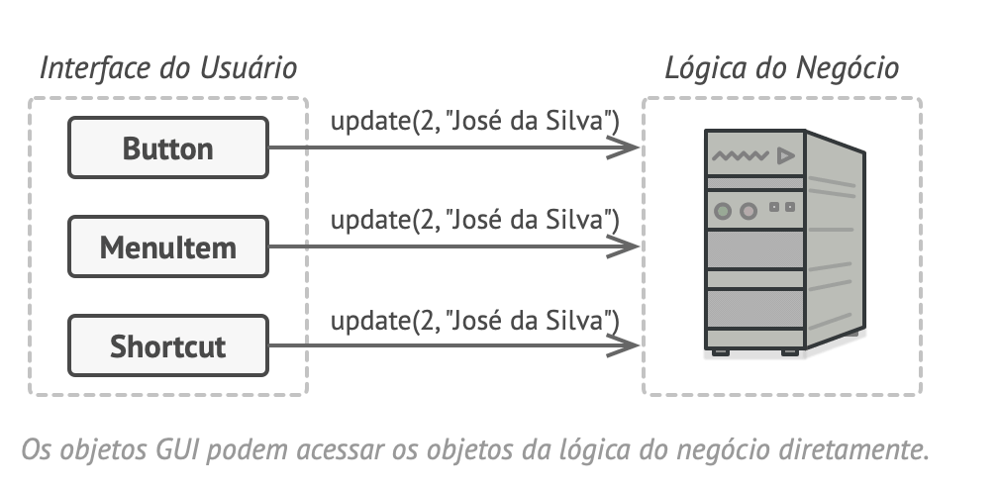
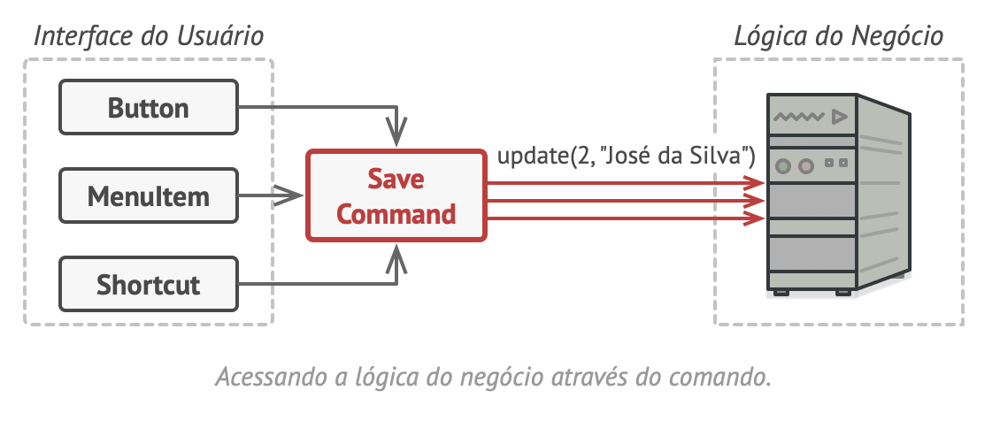
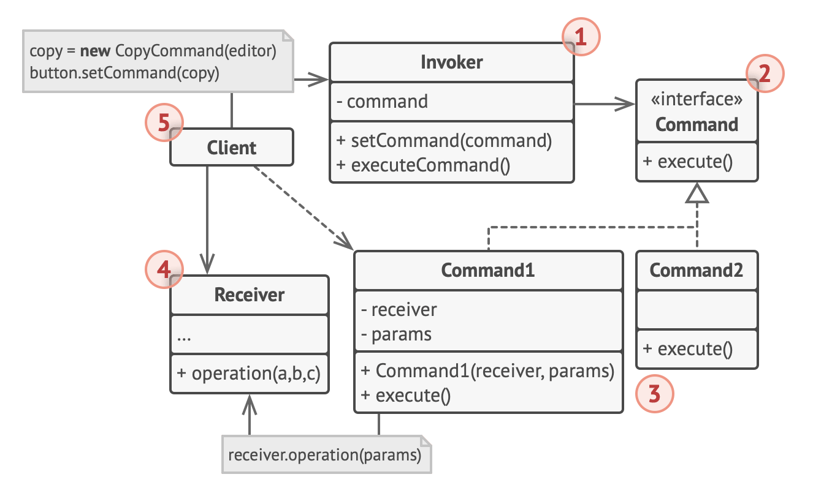
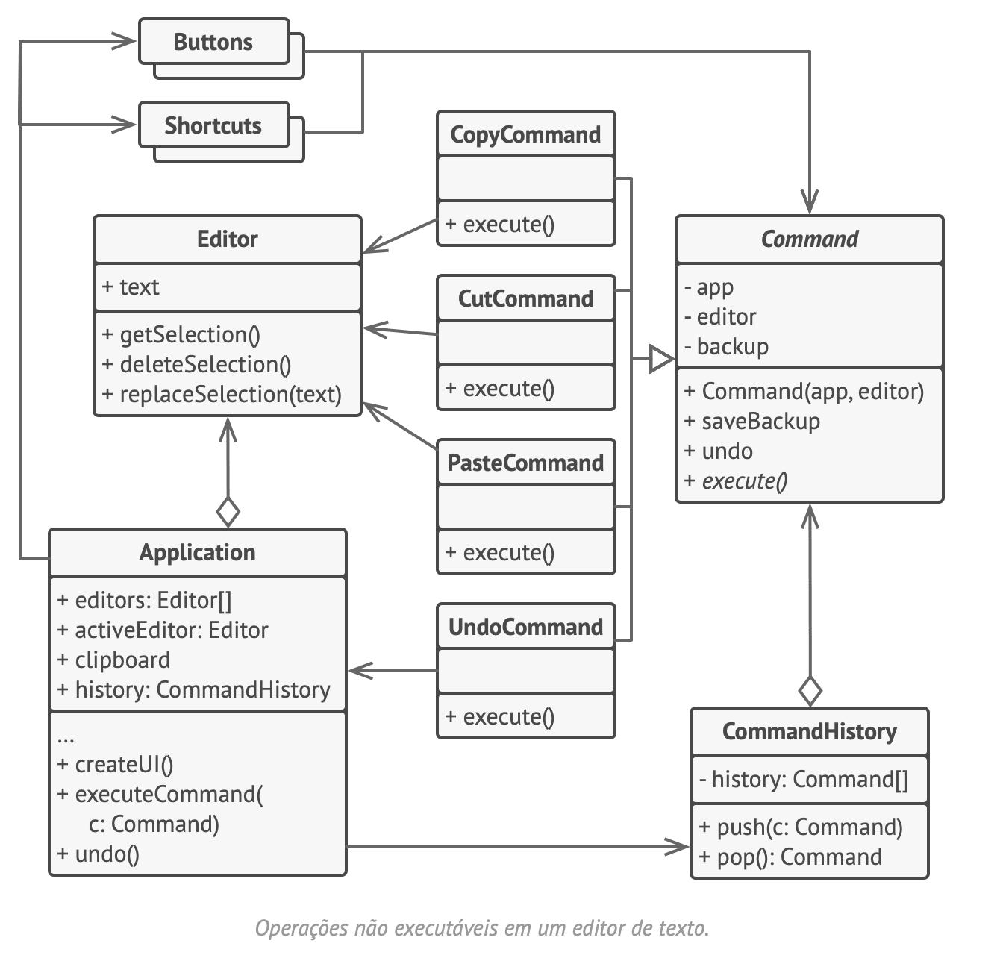

# Command
Comando, Ação, Action, Transação, Transaction

O Command é um padrão de projeto comportamental que transforma um pedido em um objeto independente que contém toda a informação sobre o pedido. Essa transformação permite que você parametrize métodos com diferentes pedidos, atrase ou coloque a execução do pedido em uma fila, e suporte operações que não podem ser feitas.

## Problema
Código acessando áreas inadequadas. 

## Solução
Envolver pedido em um objeto.

## Analogia com o mundo real
Restaurante, garçom recebe pedido -> pedido chega no chef

## Estrutura

## Pseudocódigo
Neste exemplo, o padrão Command ajuda a manter um registro da história de operações executadas e torna possível reverter uma operação se necessário.
