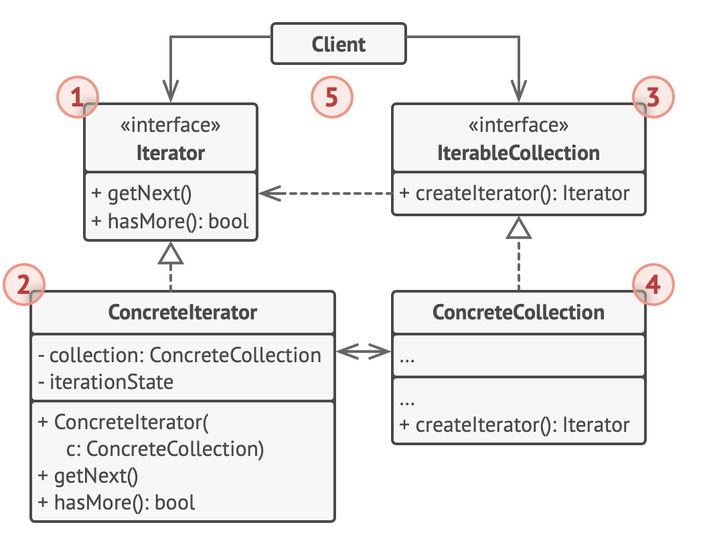
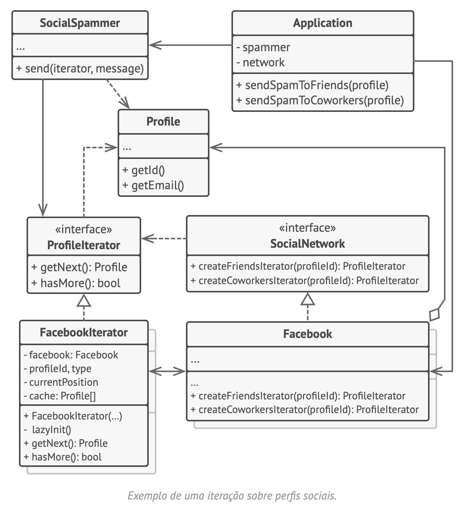

# Iterator
Iterador

O Iterator é um padrão de projeto comportamental que permite a você percorrer elementos de uma coleção sem expor as representações dele (lista, pilha, árvore, etc.)

## Solução
A ideia principal do padrão é extrair o comportamento da travessia de uma coleção para um objeto separado, chamado iterador.

Além de implementar o algoritmo em si, um objeto iterador encapsula todos os detalhes da travessia, tais como a posição atual e quantos elementos faltam para chegar ao fim. Por causa disso, alguns iteradores podem averiguar a mesma coleção ao mesmo tempo, independentemente um do outro.

## Analogia com mundo real
Passeios turísticos (por conta própria, guias virtuais, guia local).

## Estrutura

## Pseudocódigo

## Aplicabilidade
- quando sua coleção tiver uma estrutura de dados complexa por debaixo dos panos.

Trecho de
Mergulho nos Padrões de Projeto

Alexander Shvets
Este material pode estar protegido por copyright.