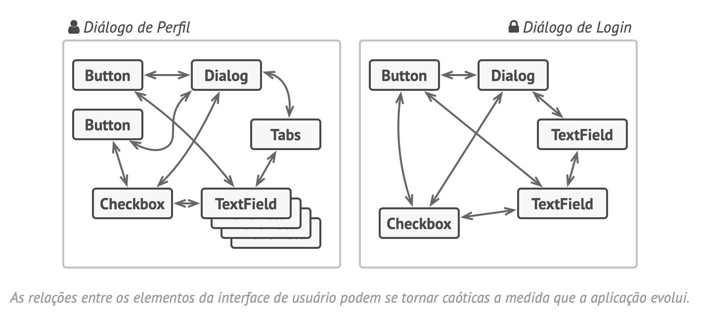
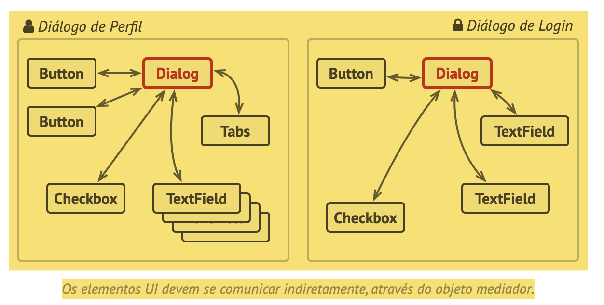
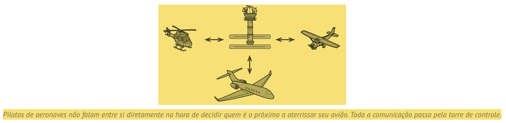
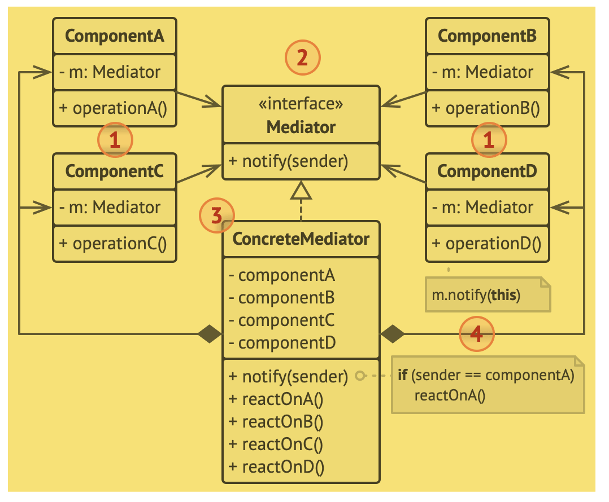
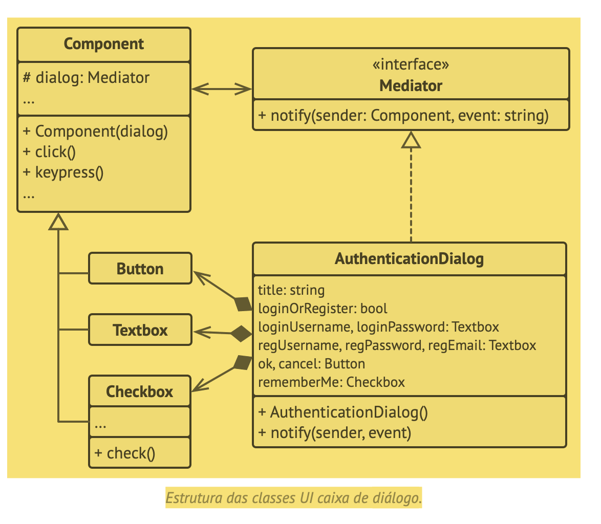

# Mediator
Também conhecido por Mediador, Intermediário, Intermediary, Controlador, Controller

O Mediator é um padrão de projeto comportamental que permite que você reduza as dependências caóticas entre objetos. O padrão restringe comunicações diretas entre objetos e os força a colaborar apenas através do objeto mediador.

## Problema

## Solução
O padrão Mediator sugere que você deveria cessar toda comunicação direta entre componentes que você quer tornar independentes um do outro. Ao invés disso, esses componentes devem colaborar indiretamente, chamando um objeto mediador especial que redireciona as chamadas para os componentes apropriados. Como resultado, os componentes dependem apenas de uma única classe mediadora ao invés de serem acoplados a dúzias de outros colegas.

O padrão Mediator permite que você encapsule uma complexa rede de relações entre vários objetos em apenas um objeto mediador. Quanto menos dependências uma classe tenha, mais fácil essa classe se torna para se modificar, estender ou reutilizar.

## Analogia com o mundo real

## Estrutura

## Pseudocódigo
Neste exemplo, o padrão Mediator ajuda você a eliminar dependências mútuas entre várias classes UI: botões, caixas de seleção e textos de rótulos.

## Aplicabilidade
- Utilize o padrão Mediator quando é difícil mudar algumas das classes porque elas estão firmemente acopladas a várias outras classes.

Trecho de
Mergulho nos Padrões de Projeto
Alexander Shvets
Este material pode estar protegido por copyright.