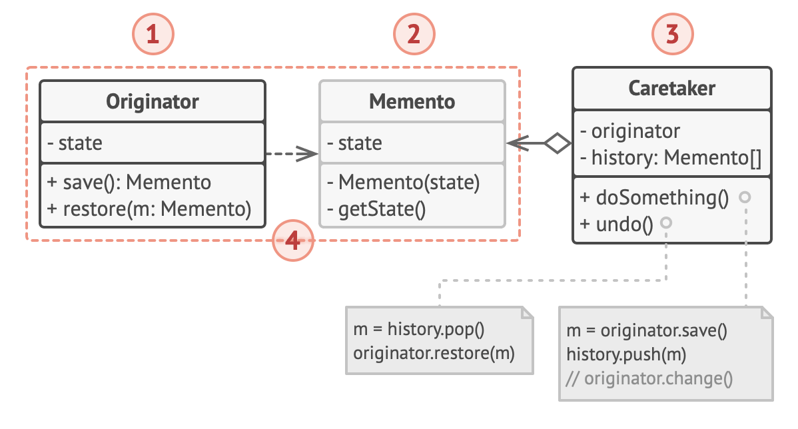
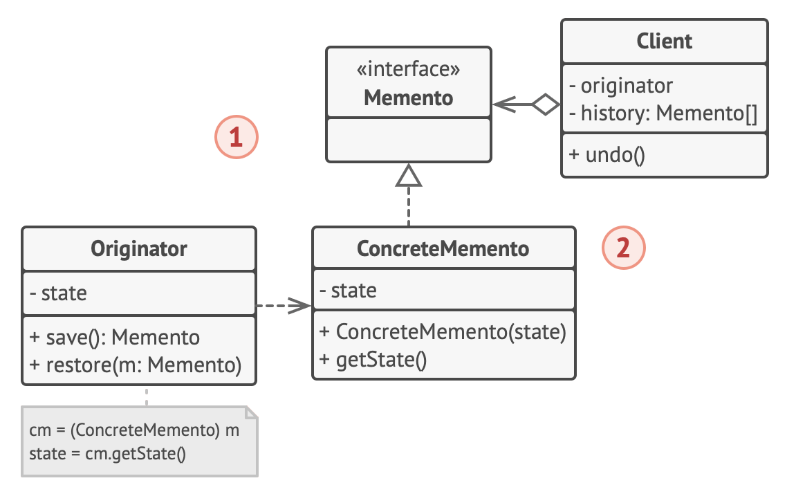
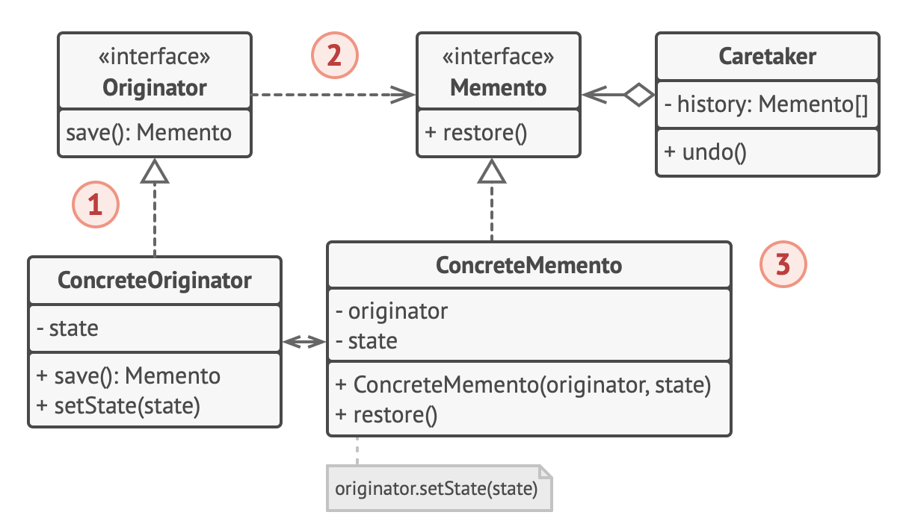
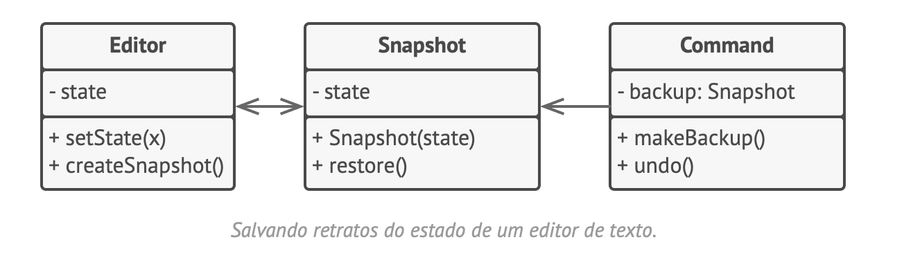

# Memento
Lembrança, Retrato, Snapshot

O Memento é um padrão de projeto comportamental que permite que você salve e restaure o estado anterior de um objeto sem revelar os detalhes de sua implementação.

## Estrutura
### Implementação baseada em classes aninhadas
A implementação clássica do padrão depende do apoio para classes aninhadas, disponível em muitas linguagens de programação populares (C++, C#, Java).

### Implementação baseada em uma interface intermediária
Há uma implementação alternativa, adequada para linguagens de programação que não suportam classes aninhadas.

### Implementação com um encapsulamento ainda mais estrito
Há ainda outra implementação que é útil quando você não quer deixar a mínima chance de outras classes acessarem o estado da originadora através do memento.

## Pseudocódigo
Este exemplo usa o padrão Memento junto com o padrão Command para armazenar retratos do estado de um editor de texto complexo e restaurá-lo para um estado anterior desses retratos quando necessário.

## Aplicabilidade
- Utilize o padrão quando você quer produzir retratos do estado de um objeto para ser capaz de restaurar um estado anterior do objeto.
- Utilize o padrão quando o acesso direto para os campos/getters/setters de um objeto viola seu encapsulamento.

Trecho de
Mergulho nos Padrões de Projeto
Alexander Shvets
Este material pode estar protegido por copyright.