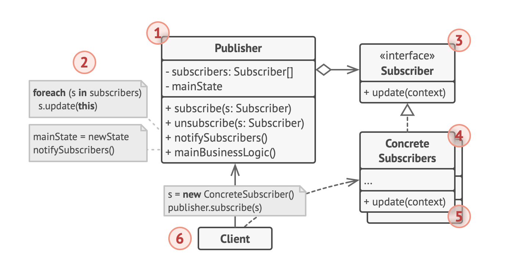
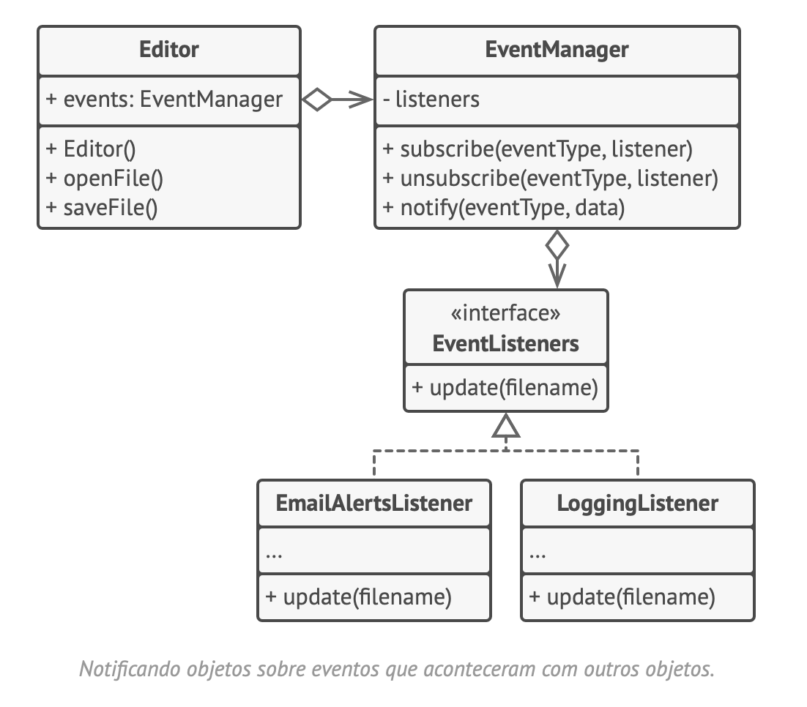

# Observer
Observador, assinante de evento, event-subscriber, listener, escutador, pub-sub

O Observer é um padrão de projeto comportamental que permite que você defina um mecanismo de assinatura para notificar múltiplos objetos sobre quaisquer eventos que aconteçam com o objeto que eles estão observando.

## Estrutura

## Pseudocódigo

## Aplicabilidade
- Utilize o padrão Observer quando mudanças no estado de um objeto podem precisar mudar outros objetos, e o atual conjunto de objetos é desconhecido de antemão ou muda dinamicamente.
- Utilize o padrão quando alguns objetos em sua aplicação devem observar outros, mas apenas por um tempo limitado ou em casos específicos.

Trecho de
Mergulho nos Padrões de Projeto
Alexander Shvets
Este material pode estar protegido por copyright.