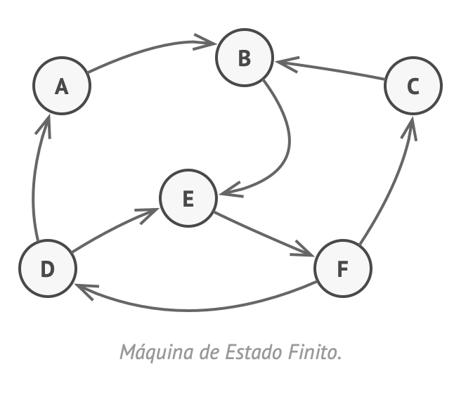
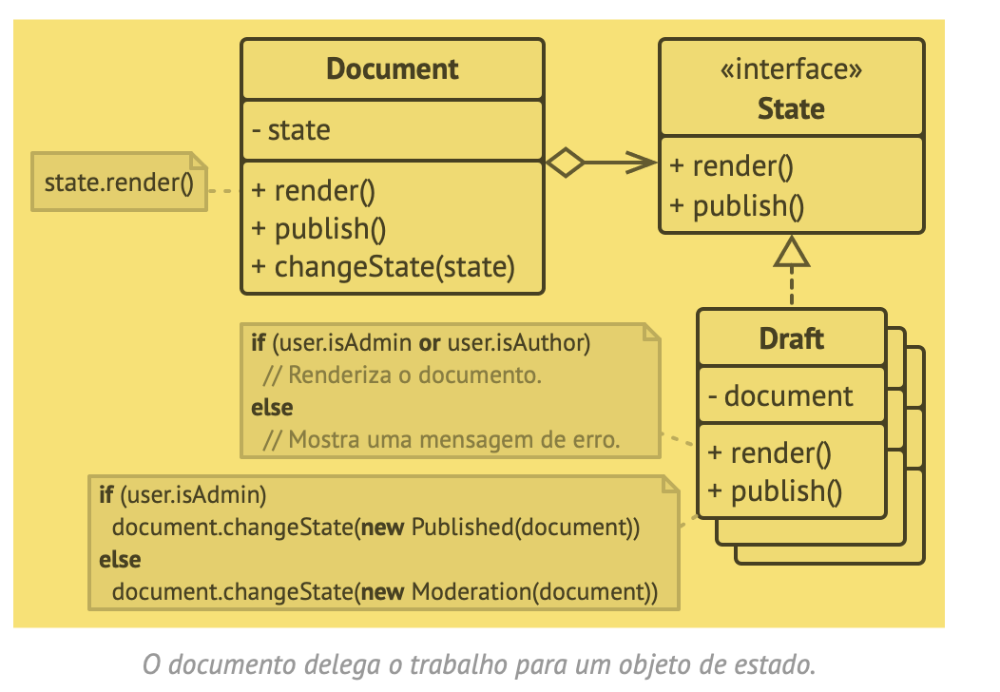
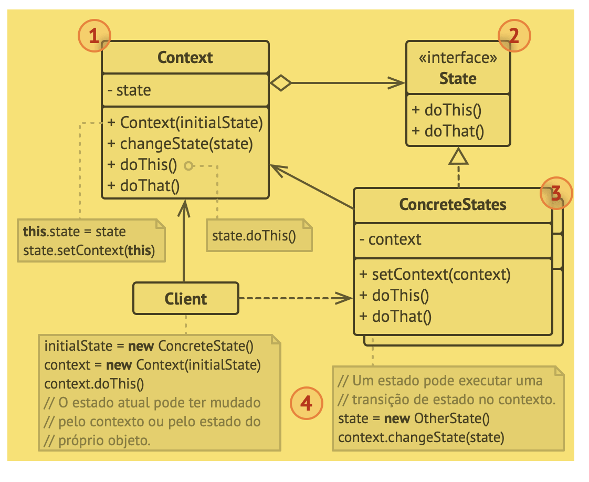
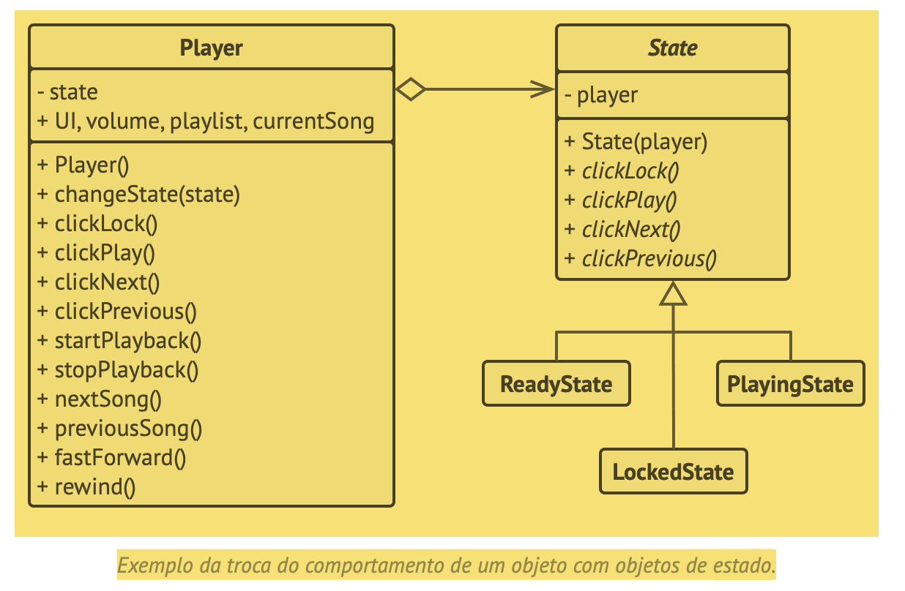

# State
Estado

O State é um padrão de projeto comportamental que permite que um objeto altere seu comportamento quando seu estado interno muda. Parece como se o objeto mudasse de classe.

## Problema
O padrão State é intimamente relacionado com o conceito de uma Máquina de Estado Finito.

Máquinas de estado são geralmente implementadas com muitos operadores de condicionais (if ou switch) que selecionam o comportamento apropriado dependendo do estado atual do objeto.

A maior fraqueza de uma máquina de estados baseada em condicionais se revela quando começamos a adicionar mais e mais estados e comportamentos baseados em estados para a classe Documento.

## Solução
O padrão State sugere que você crie novas classes para todos os estados possíveis de um objeto e extraia todos os comportamentos específicos de estados para dentro dessas classes.

Ao invés de implementar todos os comportamentos por conta própria, o objeto original, chamado contexto, armazena uma referência para um dos objetos de estado que representa seu estado atual, e delega todo o trabalho relacionado aos estados para aquele objeto.

## Estrutura

## Pseudocódigo
Neste exemplo, o padrão State permite que os mesmos controles de tocador de mídia se comportem diferentemente, dependendo do atual estado do tocador.

## Aplicabilidade
- Utilize o padrão State quando você tem um objeto que se comporta de maneira diferente dependendo do seu estado atual, quando o número de estados é enorme, e quando o código estado específico muda com frequência.
- Utilize o padrão quando você tem uma classe populada com condicionais gigantes que alteram como a classe se comporta de acordo com os valores atuais dos campos da classe.
- Utilize o State quando você tem muito código duplicado em muitos estados parecidos e transições de uma máquina de estado baseada em condições.

Trecho de
Mergulho nos Padrões de Projeto
Alexander Shvets
Este material pode estar protegido por copyright.