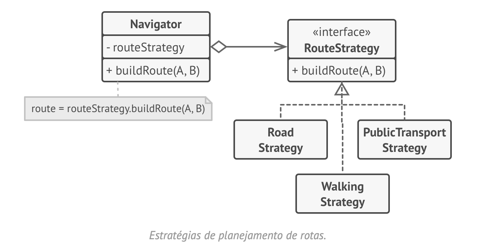
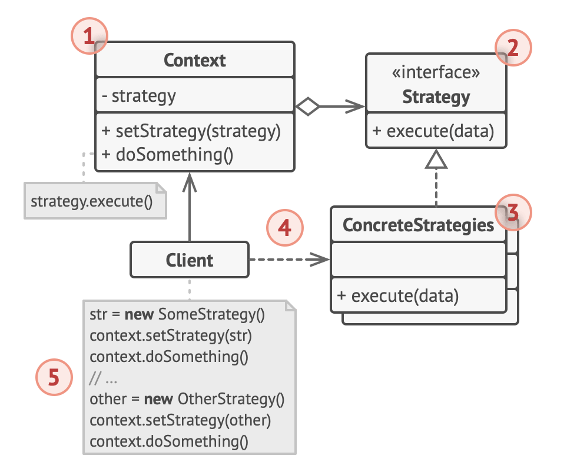

# Strategy
Estratégia

O Strategy é um padrão de projeto comportamental que permite que você defina uma família de algoritmos, coloque-os em classes separadas, e faça os objetos deles intercambiáveis.

## Problema
Aplicação para rotas => diversos meios (a pé, bicicleta, carro, ônibus, rodovias, etc) => classes e métodos inchados, difíceis de manter.

## Solução
O padrão Strategy sugere que você pegue uma classe que faz algo específico em diversas maneiras diferentes e extraia todos esses algoritmos para classes separadas chamadas estratégias.
A classe original, chamada contexto, deve ter um campo para armazenar uma referência para um dessas estratégias. O contexto delega o trabalho para um objeto estratégia ao invés de executá-lo por conta própria.

## Estrutura

## Aplicabilidade
- Utilize o padrão Strategy quando você quer usar diferentes variantes de um algoritmo dentro de um objeto e ser capaz de trocar de um algoritmo para outro durante a execução.
- Utilize o Strategy quando você tem muitas classes parecidas que somente diferem na forma que elas executam algum comportamento.
- Utilize o padrão para isolar a lógica do negócio de uma classe dos detalhes de implementação de algoritmos que podem não ser tão importantes no contexto da lógica.
- Utilize o padrão quando sua classe tem um operador condicional muito grande que troca entre diferentes variantes do mesmo algoritmo.

Trecho de
Mergulho nos Padrões de Projeto
Alexander Shvets
Este material pode estar protegido por copyright.