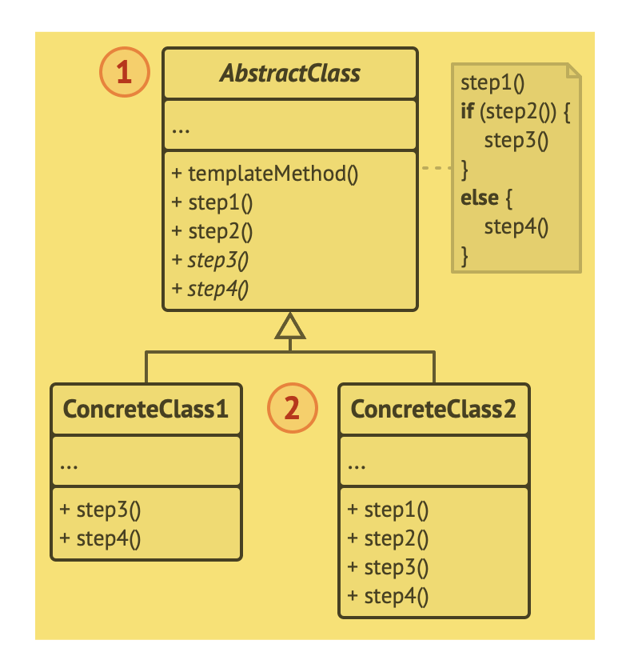

# Template method
Método padrão

O Template Method é um padrão de projeto comportamental que define o esqueleto de um algoritmo na superclasse mas deixa as subclasses sobrescreverem etapas específicas do algoritmo sem modificar sua estrutura.

## Problema
Imagine que você está criando uma aplicação de mineração de dados que analisa documentos corporativos. Os usuários alimentam a aplicação com documentos em vários formatos (PDF, DOC, CSV), e ela tenta extrair dados significativos desses documentos para um formato uniforme.

Em algum momento você percebeu que todas as três classes tem muito código repetido/parecido.

## Solução
O padrão do Template Method sugere que você quebre um algoritmo em uma série de etapas, transforme essas etapas em métodos, e coloque uma série de chamadas para esses métodos dentro de um único método padrão.

Existe outro tipo de etapa chamado ganchos(hooks). Um gancho é uma etapa opcional com um corpo vazio. Um método padrão poderia funcionar até mesmo se um hook não for sobrescrito. Geralmente os hooks são colocados antes e depois de etapas cruciais de algoritmos, fornecendo às subclasses com pontos de extensão adicionais para um algoritmo.

## Estrutura

## Pseudo-código
Neste exemplo, o padrão Template Method fornece um “esqueleto” para várias ramificações de inteligência artificial de um jogo de estratégia simples.

## Aplicabilidade
- Utilize o padrão Template Method quando você quer deixar os clientes estender etapas particulares de um algoritmo, mas não todo o algoritmo e sua estrutura.
- Utilize o padrão quando você tem várias classes que contém algoritmos quase idênticos com algumas diferenças menores. Como resultado, você pode querer modificar todas as classes quando o algoritmo muda.

Trecho de
Mergulho nos Padrões de Projeto
Alexander Shvets
Este material pode estar protegido por copyright.