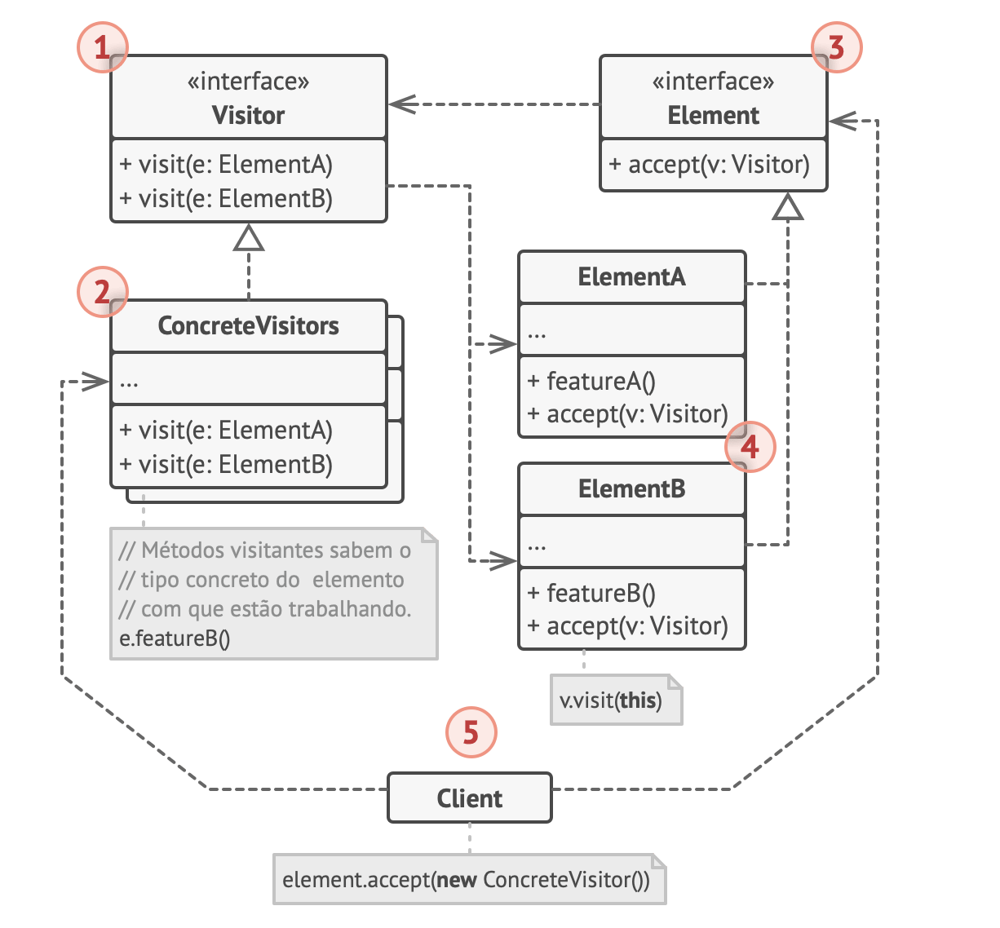
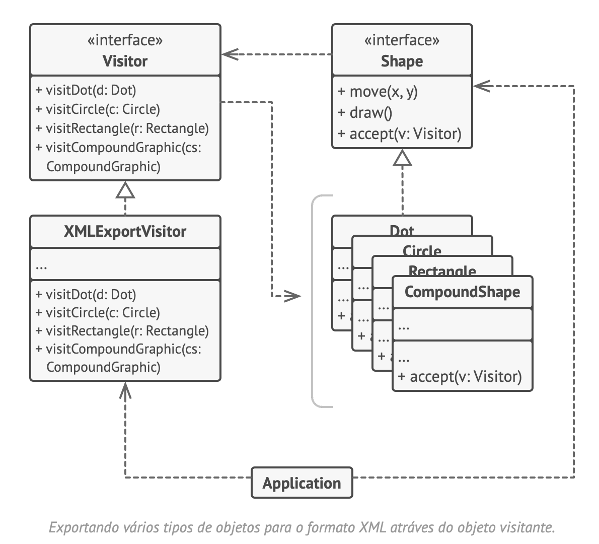

# Visitor
Visitante

O Visitor é um padrão de projeto comportamental que permite que você separe algoritmos dos objetos nos quais eles operam.

## Analogia com o mundo real
Um bom agente de seguros está sempre pronto para oferecer diferentes apólices para vários tipos de organizações.

## Estrutura

## Pseudo-código
Neste exemplo, o padrão Visitor adiciona suporte a exportação XML para a hierarquia de classe de formas geométricas.

## Aplicabilidade
- Utilize o Visitor quando você precisa fazer uma operação em todos os elementos de uma estrutura de objetos complexa (por exemplo, uma árvore de objetos).
- Utilize o Visitor para limpar a lógica de negócio de comportamentos auxiliares.